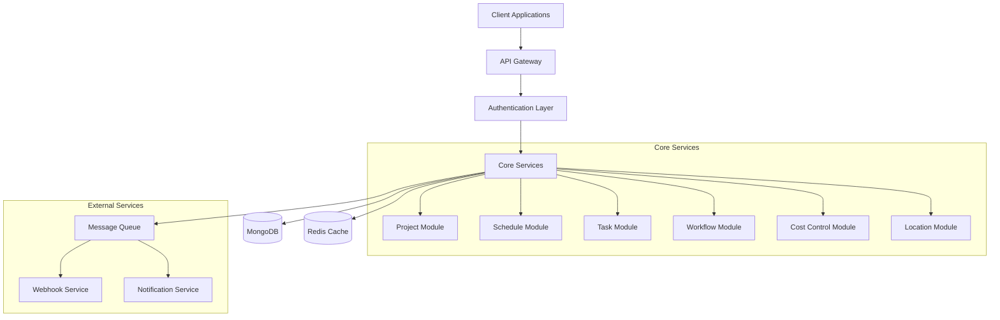
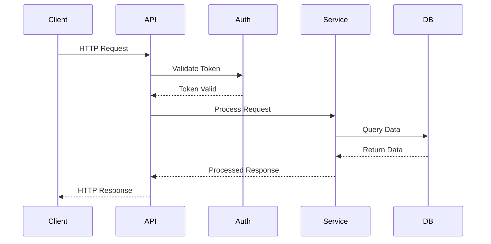
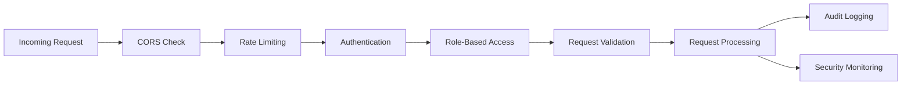
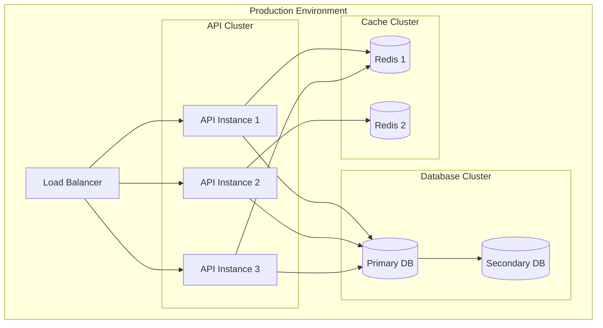

# Architecture Overview

## System Architecture

## Technology Stack

### Core Technologies
- **Framework**: NestJS
- **Language**: TypeScript
- **Database**: MongoDB with Typegoose ORM
- **Authentication**: JWT with Bearer tokens
- **Documentation**: Swagger/OpenAPI
- **Logging**: Log4js
- **Rate Limiting**: ThrottlerModule
- **Security**: Helmet

### Key Components

1. **API Gateway**
   - Request routing
   - Rate limiting
   - Request validation
   - Response transformation

2. **Authentication Layer**
   - JWT validation
   - Role-based access control
   - Session management

3. **Core Services**
   - Modular architecture
   - Microservices communication
   - Business logic implementation

4. **Data Layer**
   - MongoDB for persistent storage
   - Redis for caching
   - Message queue for async operations

5. **External Services**
   - Webhook processing
   - Notification delivery
   - Integration points

## System Flow

## Security Architecture

## Deployment Architecture

