# Data API Architecture

## System Architecture

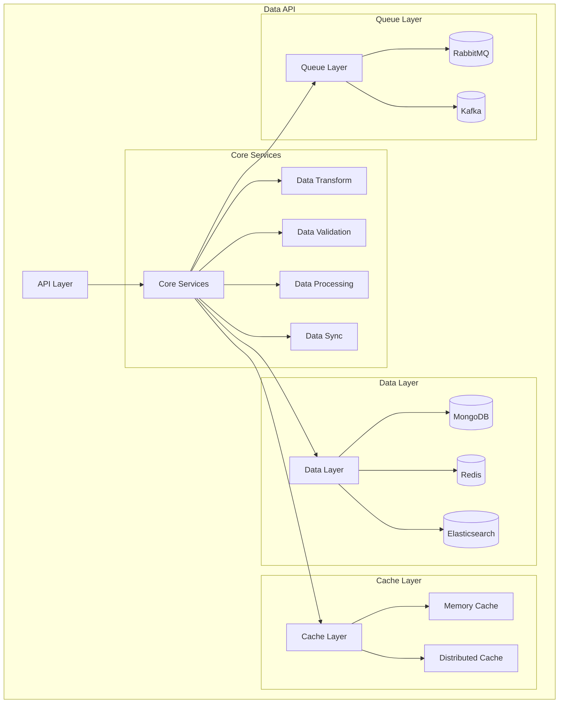

## Component Architecture

### 1. API Layer

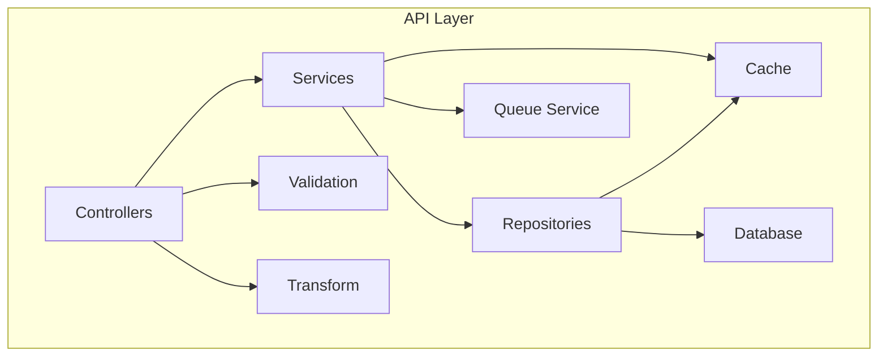

### 2. Data Processing Layer

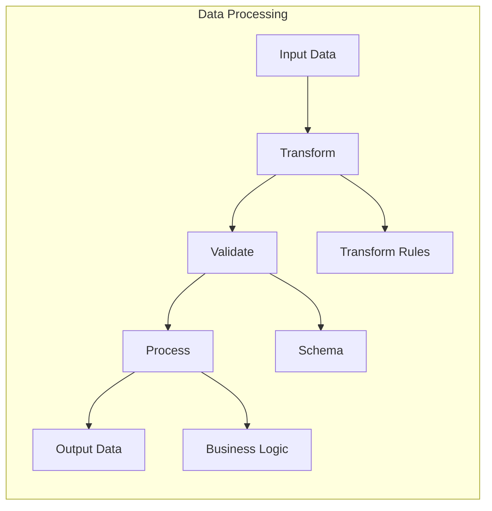

### 3. Cache Architecture

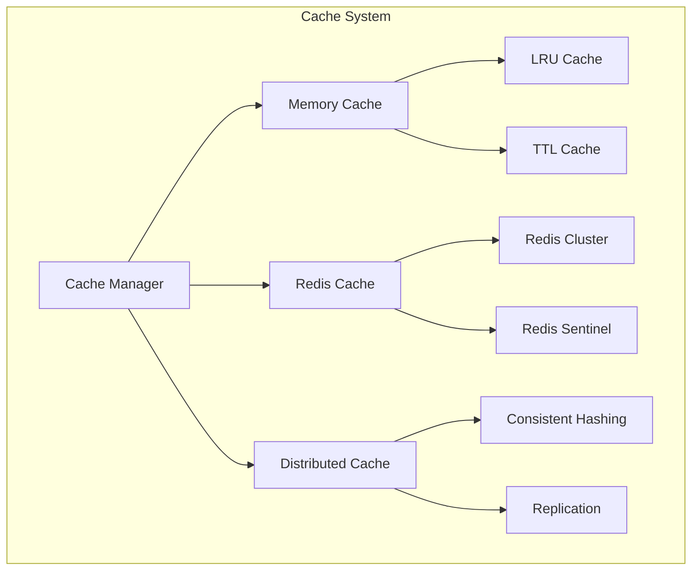

### 4. Queue Architecture

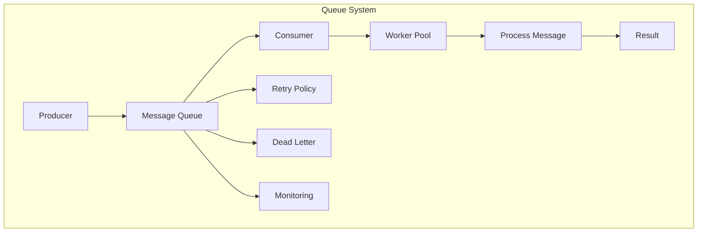

## Data Flow Architecture

### 1. Read Operation Flow

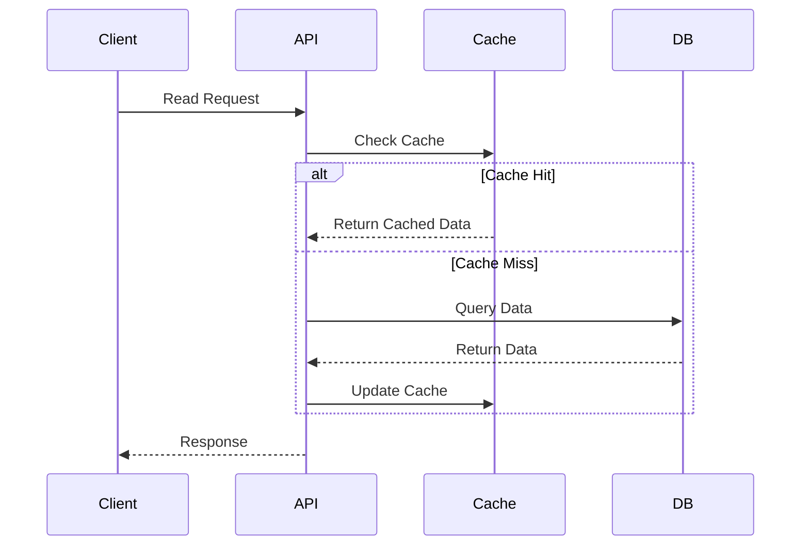

### 2. Write Operation Flow

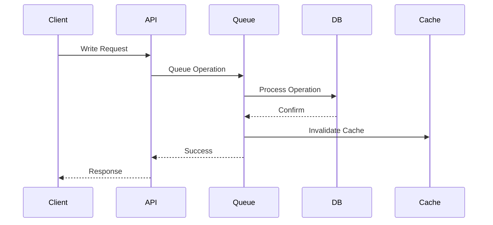

### 3. Batch Processing Flow

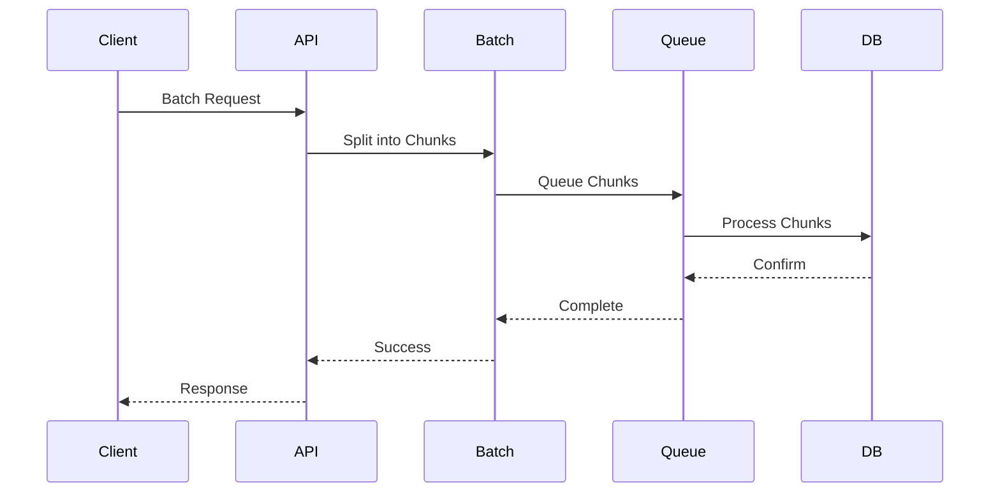

## Security Architecture

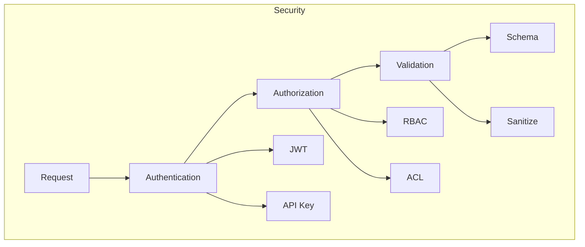

## Monitoring Architecture

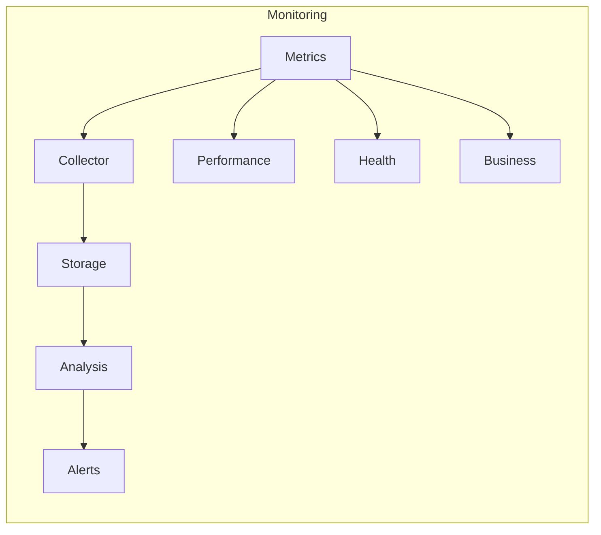

## Deployment Architecture

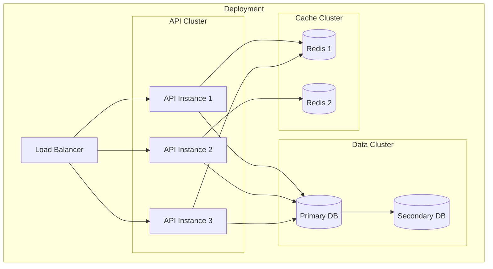