# Data API Flow Documentation

## Data Processing Flow

### 1. Data Ingestion Flow

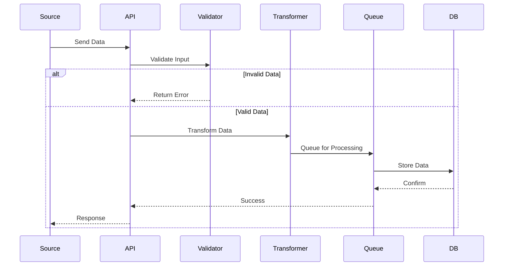

### 2. Data Transformation Flow

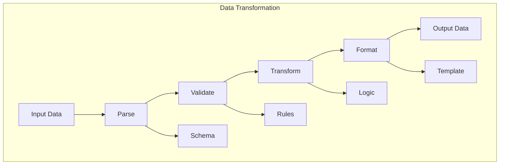

### 3. Data Validation Flow

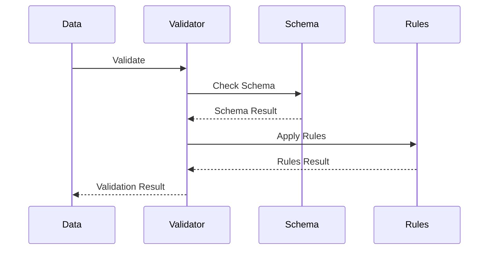

## Data Integration Flow

### 1. External System Integration

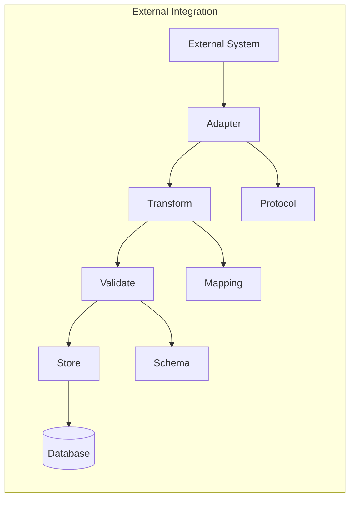

### 2. Data Synchronization Flow

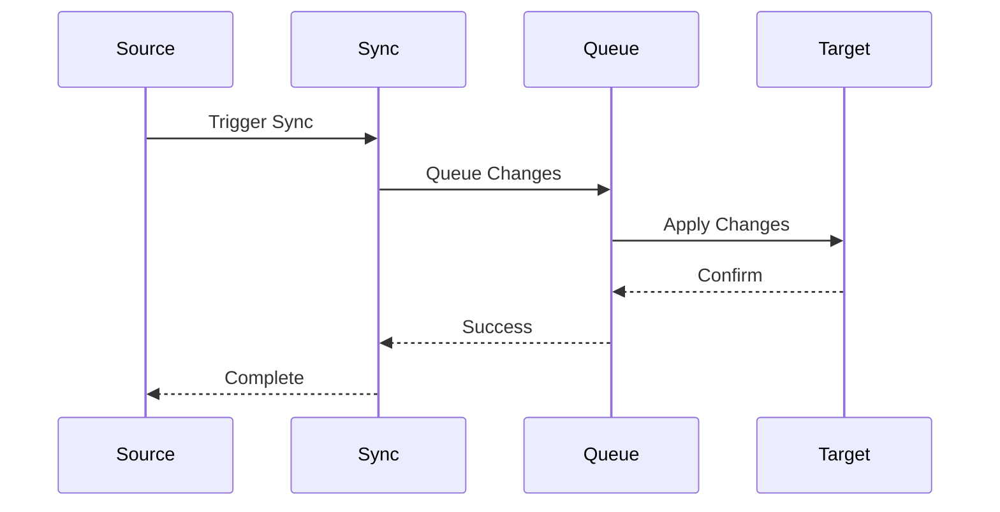

### 3. Real-time Data Flow

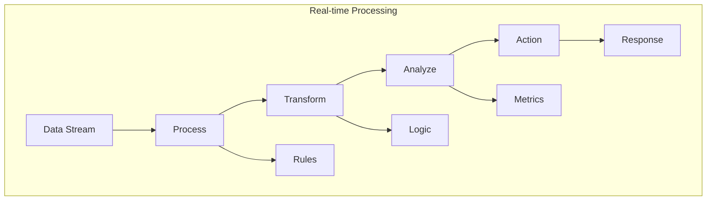

## Data Storage Flow

### 1. Write Operation Flow

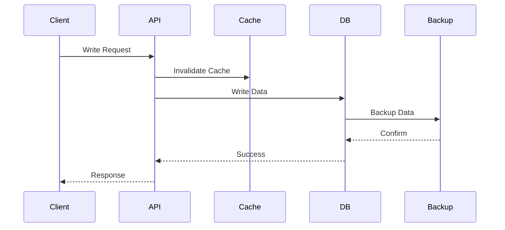

### 2. Read Operation Flow

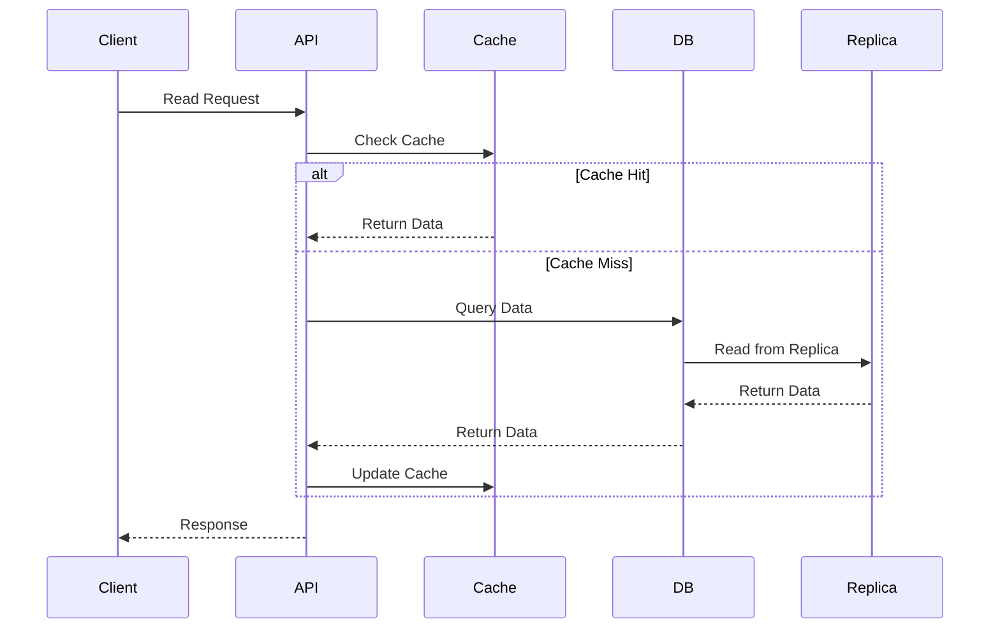

### 3. Data Migration Flow

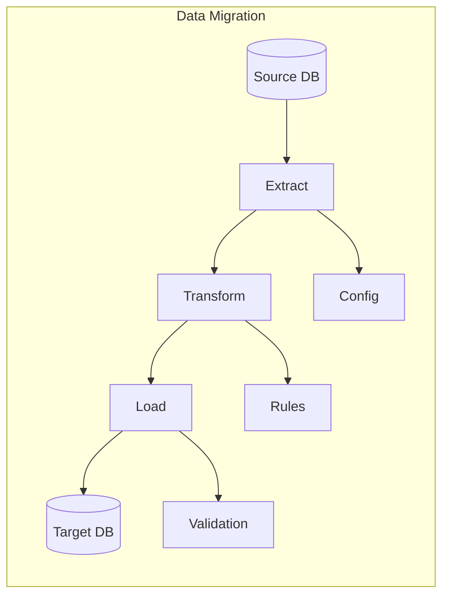

## Data Processing Features

### 1. Batch Processing

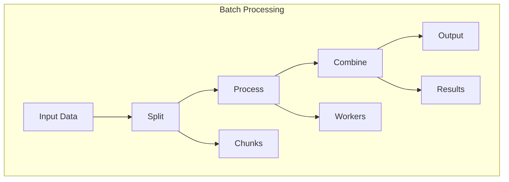

### 2. Stream Processing

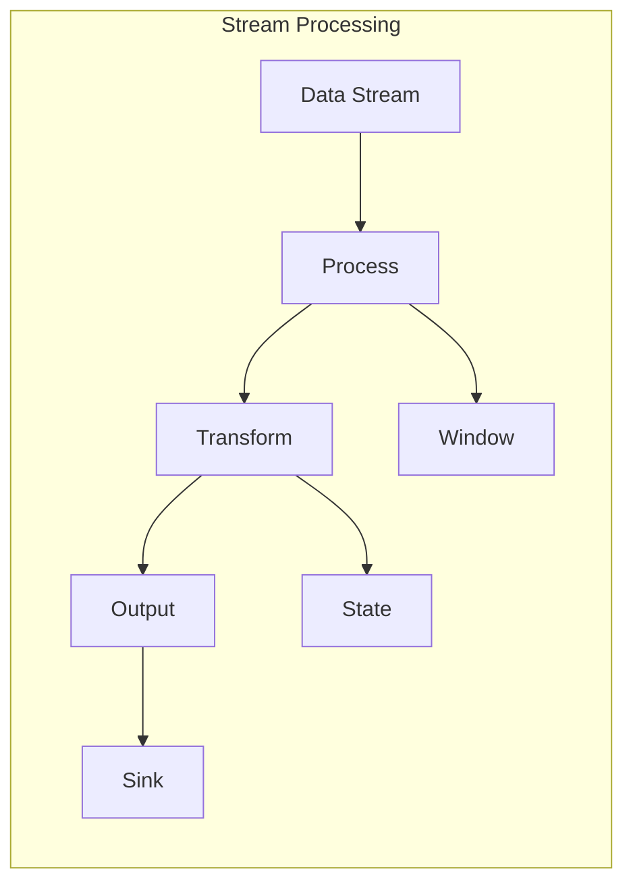

### 3. Data Enrichment

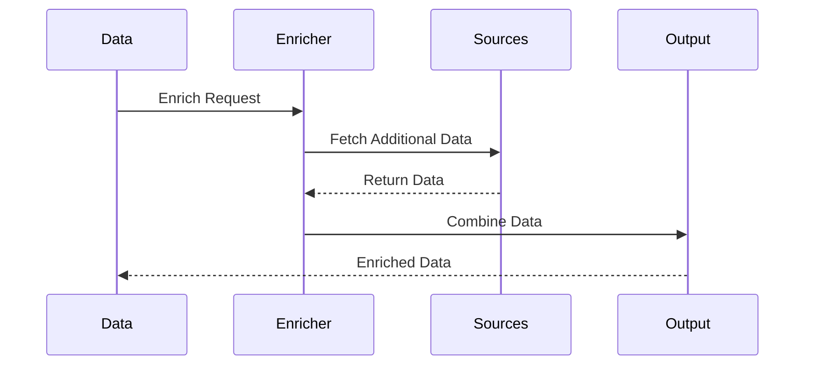

## Error Handling Flow

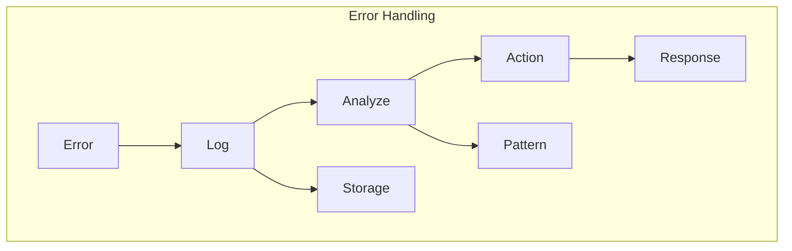

## Performance Optimization Flow

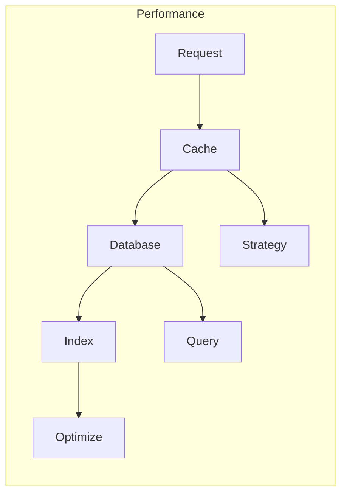