# Data API Features Documentation

## Core Features

### 1. Data Transformation

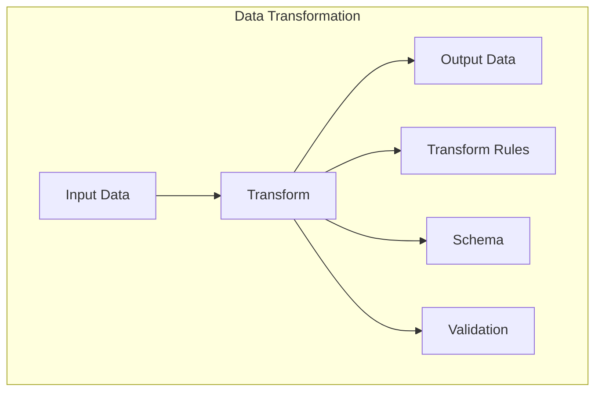

**Advantages:**
- Flexible data format conversion
- Schema validation and enforcement
- Custom transformation rules
- Data quality assurance

### 2. Data Validation

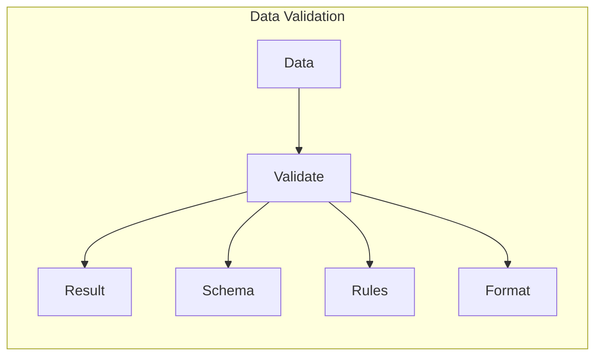

**Advantages:**
- Data integrity assurance
- Schema compliance
- Custom validation rules
- Format verification

### 3. Data Processing

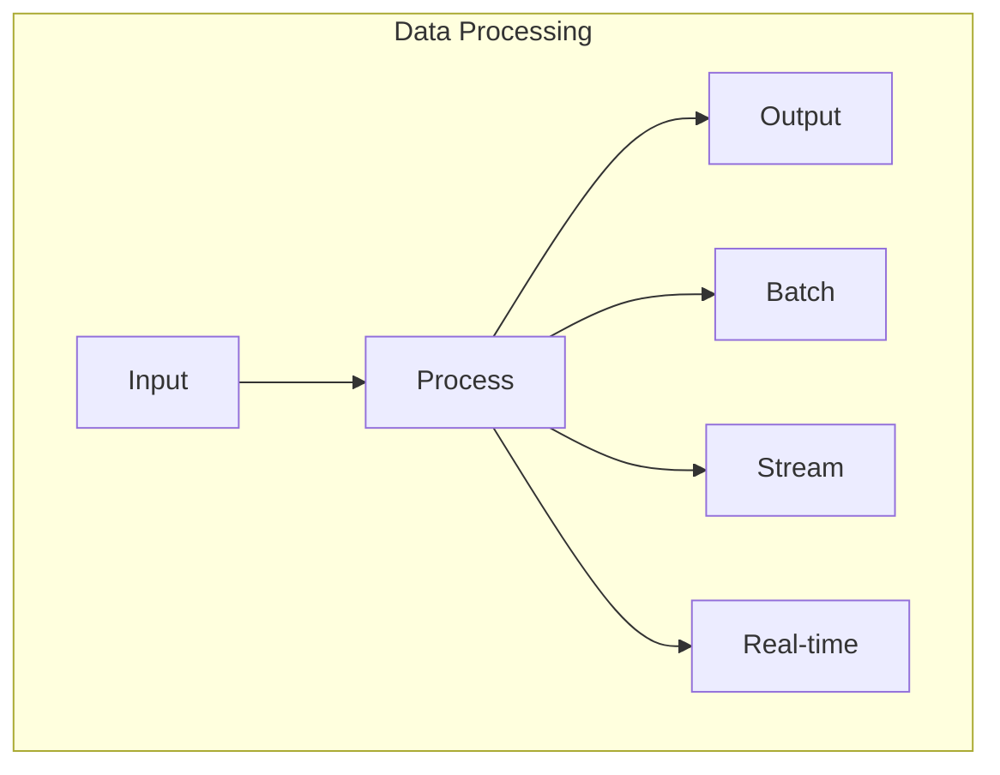

**Advantages:**
- Multiple processing modes
- Scalable architecture
- Real-time capabilities
- Batch processing support

## Integration Features

### 1. External System Integration

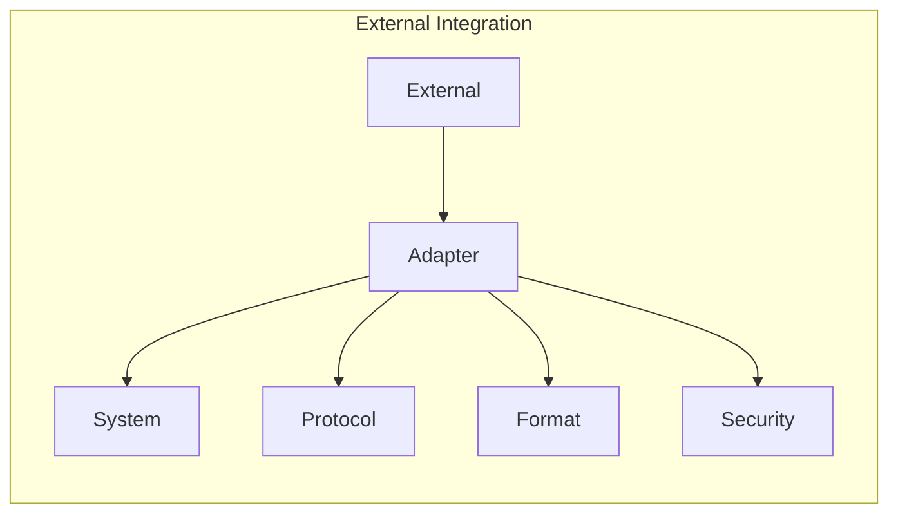

**Advantages:**
- Protocol flexibility
- Format compatibility
- Secure integration
- Easy configuration

### 2. Data Synchronization

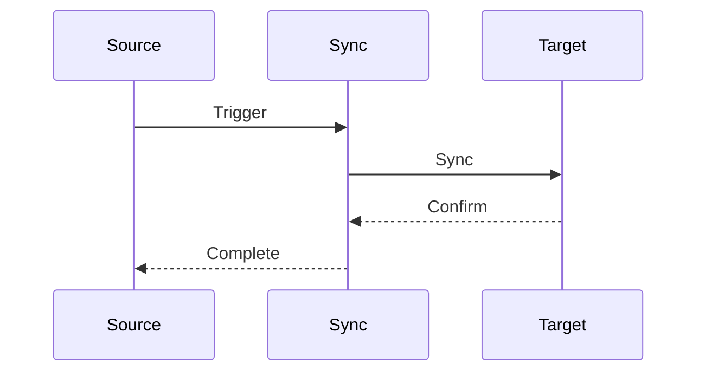

**Advantages:**
- Real-time sync
- Conflict resolution
- Data consistency
- Reliable delivery

### 3. API Integration

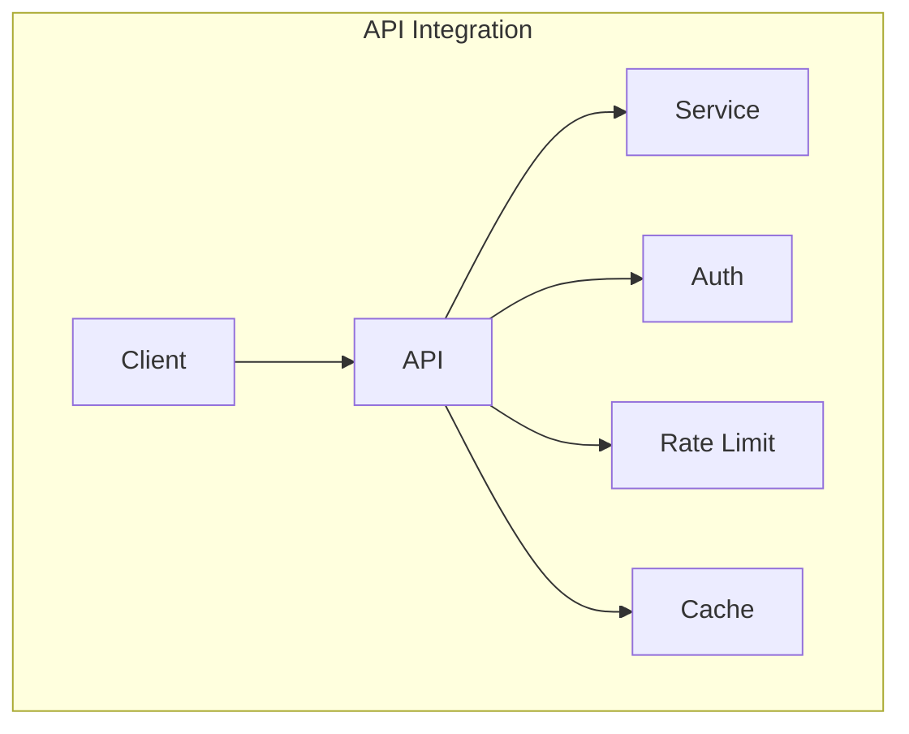

**Advantages:**
- Authentication support
- Rate limiting
- Caching
- Version control

## Storage Features

### 1. Data Storage

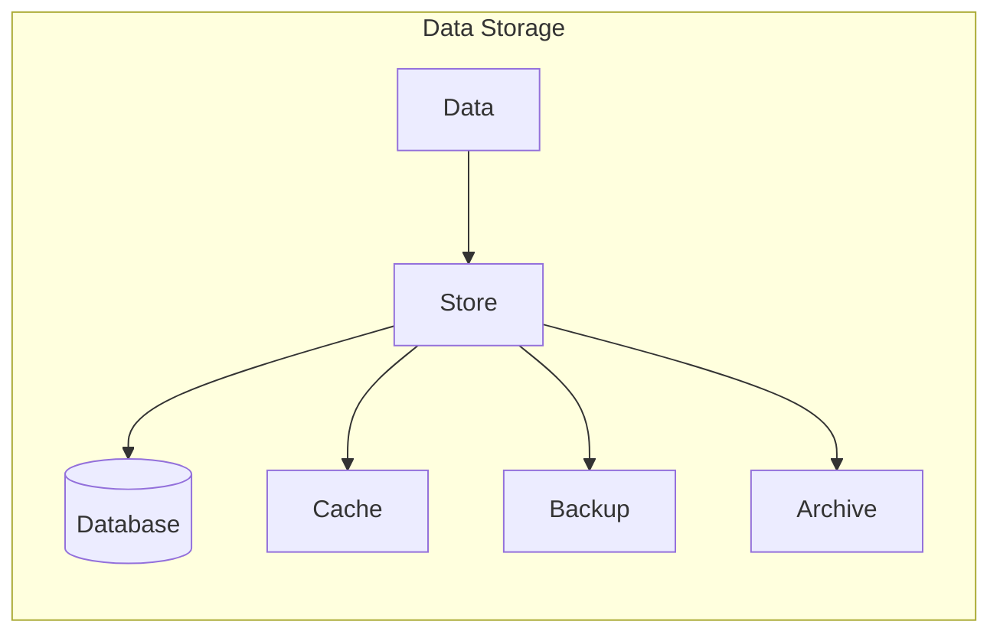

**Advantages:**
- Multiple storage options
- Caching support
- Backup capabilities
- Archiving features

### 2. Data Retrieval

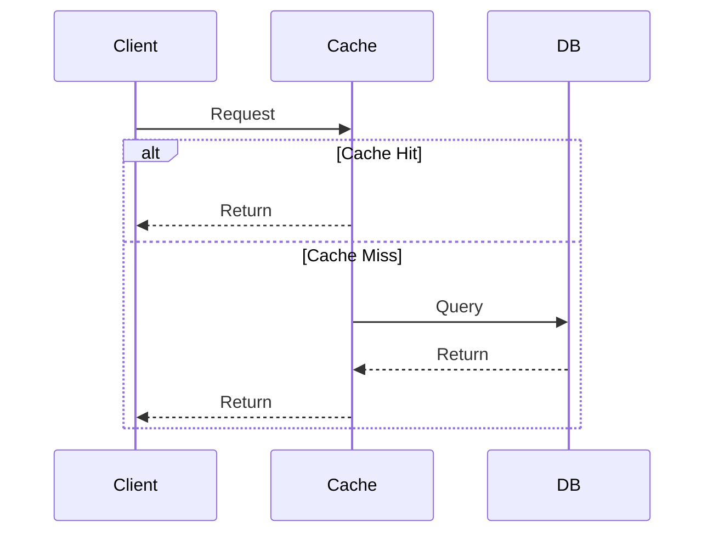

**Advantages:**
- Fast retrieval
- Cache optimization
- Query flexibility
- Result pagination

### 3. Data Management

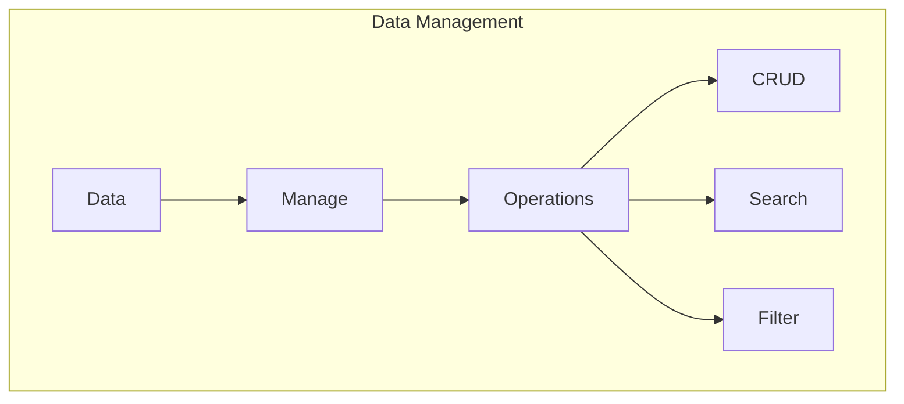

**Advantages:**
- CRUD operations
- Advanced search
- Filtering capabilities
- Data organization

## Security Features

### 1. Authentication

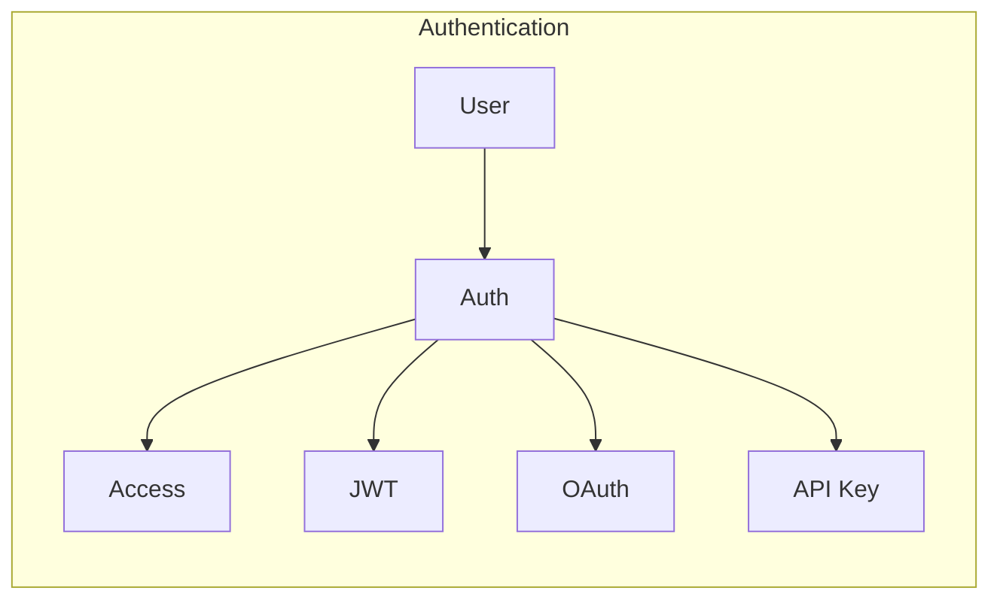

**Advantages:**
- Multiple auth methods
- Token management
- Session control
- Access control

### 2. Authorization

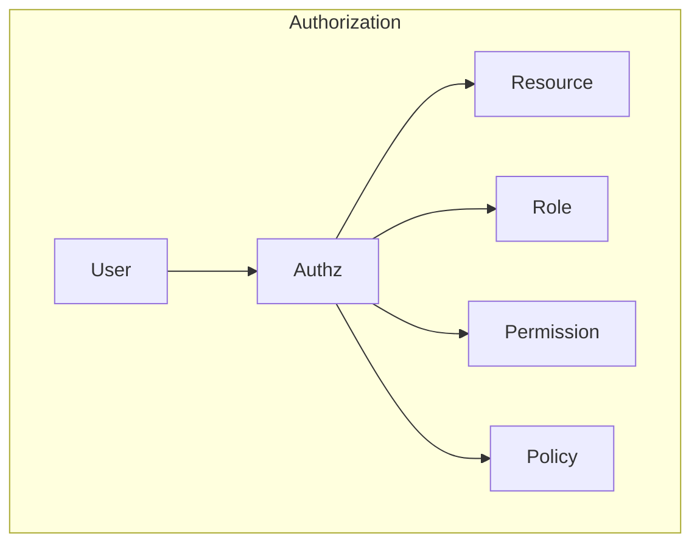

**Advantages:**
- Role-based access
- Permission management
- Policy enforcement
- Resource protection

### 3. Data Security

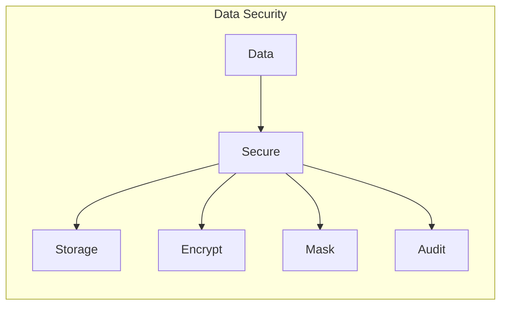

**Advantages:**
- Data encryption
- Data masking
- Audit logging
- Compliance support

## Monitoring Features

### 1. Performance Monitoring

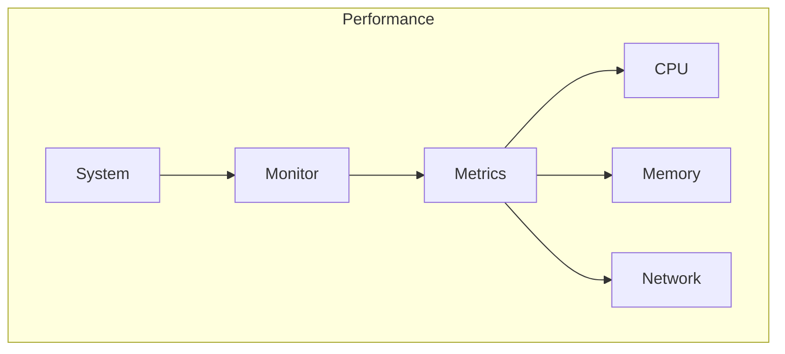

**Advantages:**
- Resource monitoring
- Performance metrics
- Bottleneck detection
- Optimization support

### 2. Health Monitoring

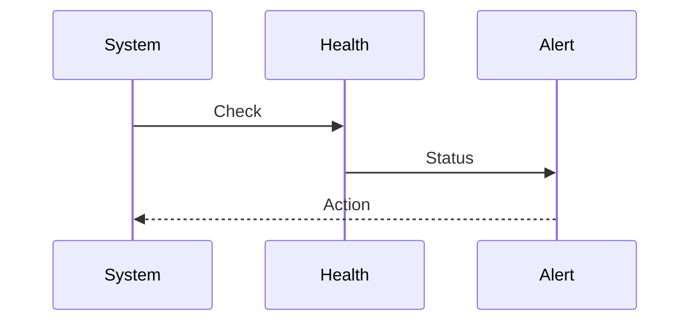

**Advantages:**
- System health checks
- Alert management
- Status reporting
- Recovery support

### 3. Usage Monitoring

```mermaid
graph LR
    subgraph Usage
        User[User] --> Track[Track]
        Track --> Analytics[Analytics]
        
        Analytics --> Usage[Usage]
        Analytics --> Pattern[Pattern]
        Analytics --> Report[Report]
    end
```

**Advantages:**
- Usage tracking
- Pattern analysis
- Reporting capabilities
- Usage optimization

## Development Features

### 1. API Development

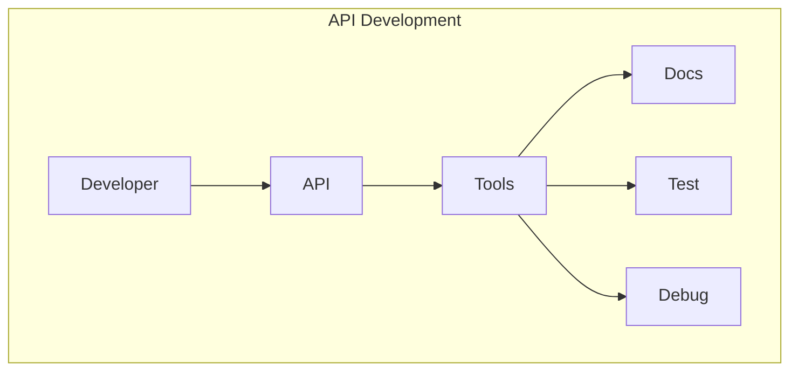

**Advantages:**
- API documentation
- Testing support
- Debugging tools
- Development workflow

### 2. Integration Development

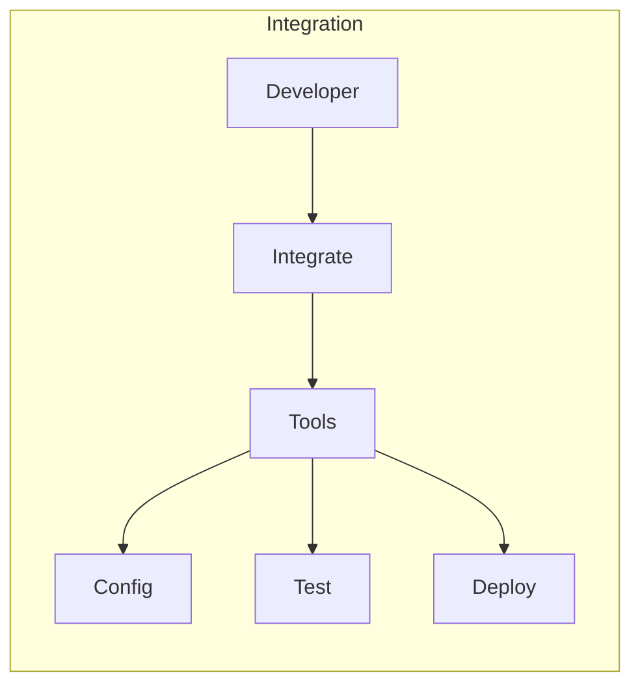

**Advantages:**
- Integration tools
- Configuration management
- Testing framework
- Deployment support

### 3. Custom Development

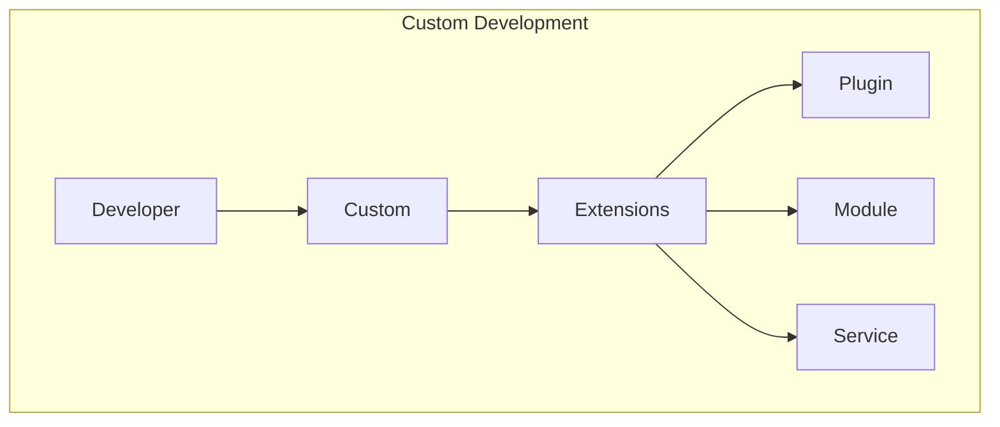

**Advantages:**
- Plugin support
- Module system
- Service extension
- Custom functionality 