# Data API Integration Points Documentation

## External System Integration

### 1. REST API Integration

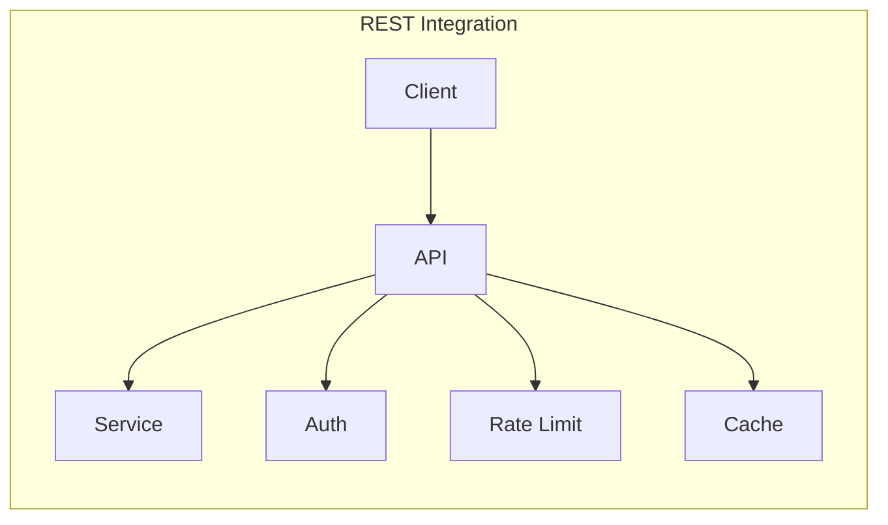
```mermaid
graph LR
    subgraph REST Integration
        Client[Client] --> API[API]
        API --> Service[Service]
        
        API --> Auth[Auth]
        API --> Rate[Rate Limit]
        API --> Cache[Cache]
    end
```

**Integration Points:**
- Authentication endpoints
- Data endpoints
- Management endpoints
- Monitoring endpoints

### 2. Webhook Integration

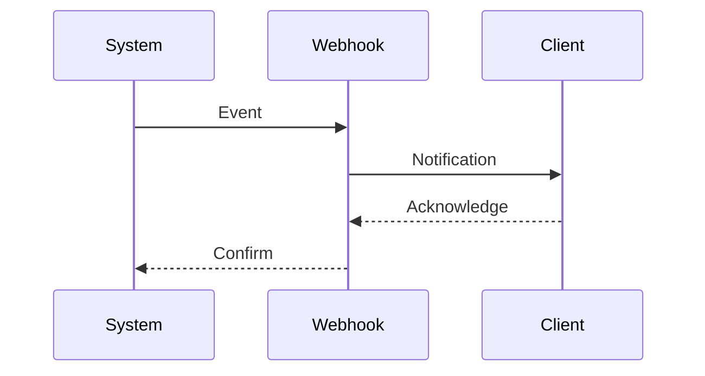
```mermaid
sequenceDiagram
    participant System
    participant Webhook
    participant Client
    
    System->>Webhook: Event
    Webhook->>Client: Notification
    Client-->>Webhook: Acknowledge
    Webhook-->>System: Confirm
```

**Integration Points:**
- Event subscription
- Webhook configuration
- Event delivery
- Status monitoring

### 3. Message Queue Integration

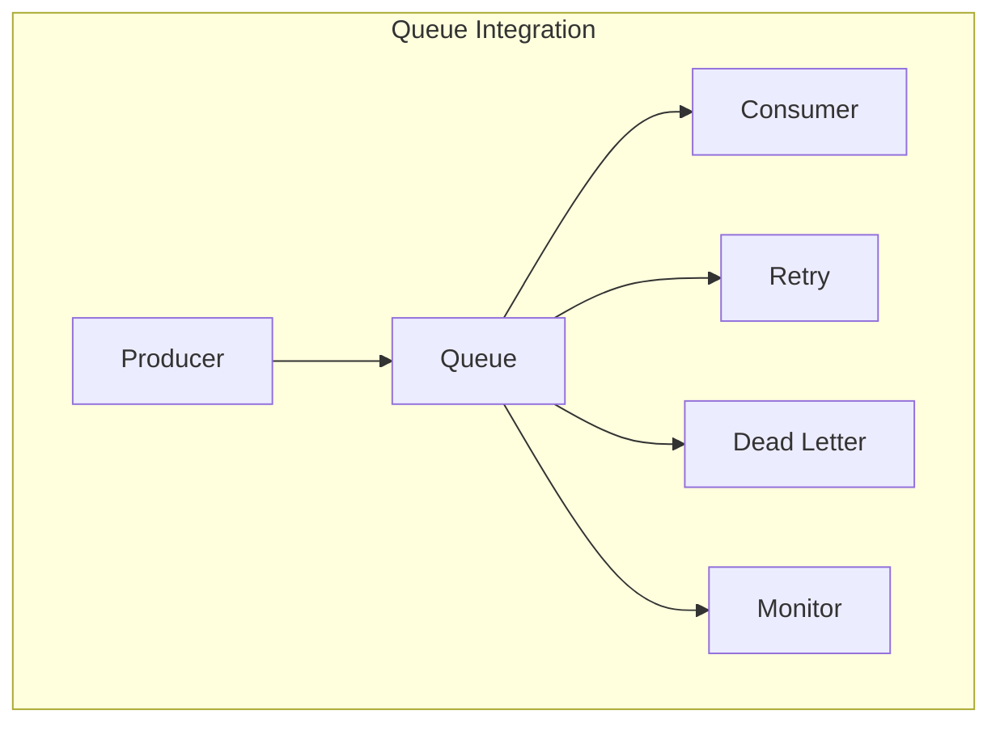
```mermaid
graph TB
    subgraph Queue Integration
        Producer[Producer] --> Queue[Queue]
        Queue --> Consumer[Consumer]
        
        Queue --> Retry[Retry]
        Queue --> DeadLetter[Dead Letter]
        Queue --> Monitor[Monitor]
    end
```

**Integration Points:**
- Queue configuration
- Message publishing
- Message consumption
- Queue management

## Data Integration

### 1. Database Integration

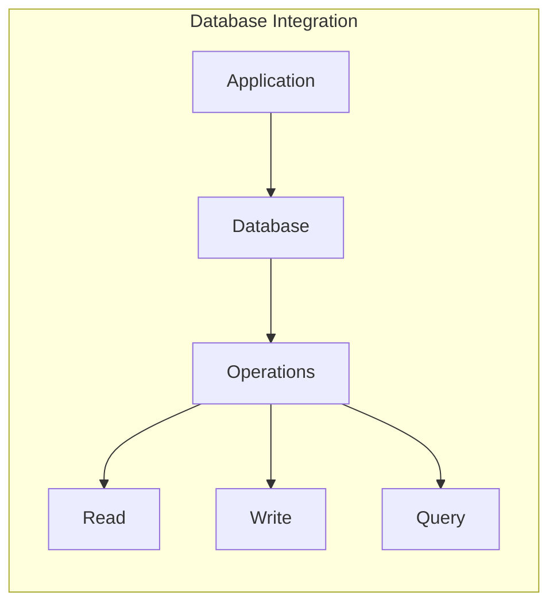
```mermaid
graph LR
    subgraph Database Integration
        App[Application] --> DB[Database]
        DB --> Operations[Operations]
        
        Operations --> Read[Read]
        Operations --> Write[Write]
        Operations --> Query[Query]
    end
```

**Integration Points:**
- Connection management
- Query execution
- Transaction handling
- Connection pooling

### 2. Cache Integration

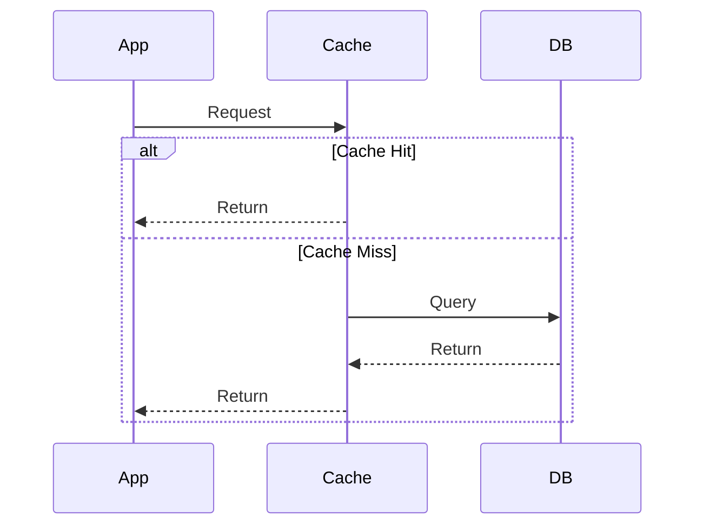
```mermaid
sequenceDiagram
    participant App
    participant Cache
    participant DB
    
    App->>Cache: Request
    alt Cache Hit
        Cache-->>App: Return
    else Cache Miss
        Cache->>DB: Query
        DB-->>Cache: Return
        Cache-->>App: Return
    end
```

**Integration Points:**
- Cache configuration
- Cache operations
- Cache invalidation
- Cache monitoring

### 3. Search Integration

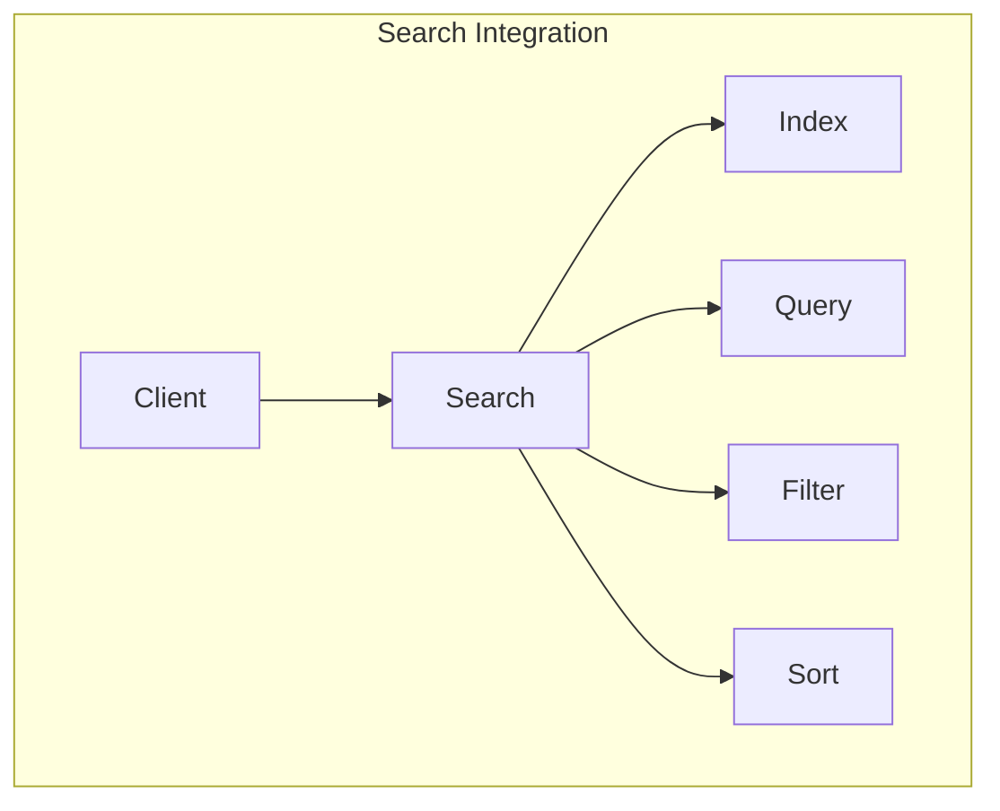
```mermaid
graph TB
    subgraph Search Integration
        Client[Client] --> Search[Search]
        Search --> Index[Index]
        
        Search --> Query[Query]
        Search --> Filter[Filter]
        Search --> Sort[Sort]
    end
```

**Integration Points:**
- Index management
- Search operations
- Filter configuration
- Result processing

## Service Integration

### 1. Authentication Service

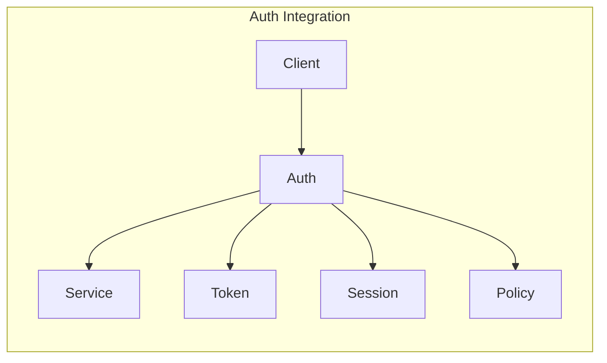
```mermaid
graph LR
    subgraph Auth Integration
        Client[Client] --> Auth[Auth]
        Auth --> Service[Service]
        
        Auth --> Token[Token]
        Auth --> Session[Session]
        Auth --> Policy[Policy]
    end
```

**Integration Points:**
- Token management
- Session handling
- Policy enforcement
- User management

### 2. Storage Service

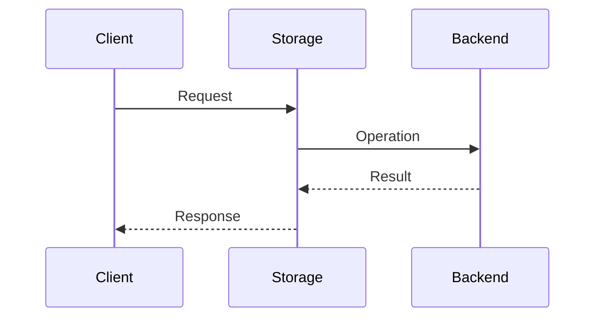
```mermaid
sequenceDiagram
    participant Client
    participant Storage
    participant Backend
    
    Client->>Storage: Request
    Storage->>Backend: Operation
    Backend-->>Storage: Result
    Storage-->>Client: Response
```

**Integration Points:**
- File operations
- Storage management
- Access control
- Backup/restore

### 3. Notification Service

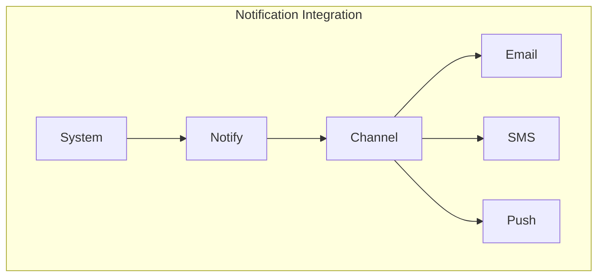
```mermaid
graph TB
    subgraph Notification Integration
        System[System] --> Notify[Notify]
        Notify --> Channel[Channel]
        
        Channel --> Email[Email]
        Channel --> SMS[SMS]
        Channel --> Push[Push]
    end
```

**Integration Points:**
- Channel configuration
- Message delivery
- Status tracking
- Template management

## Protocol Integration

### 1. HTTP/HTTPS Integration

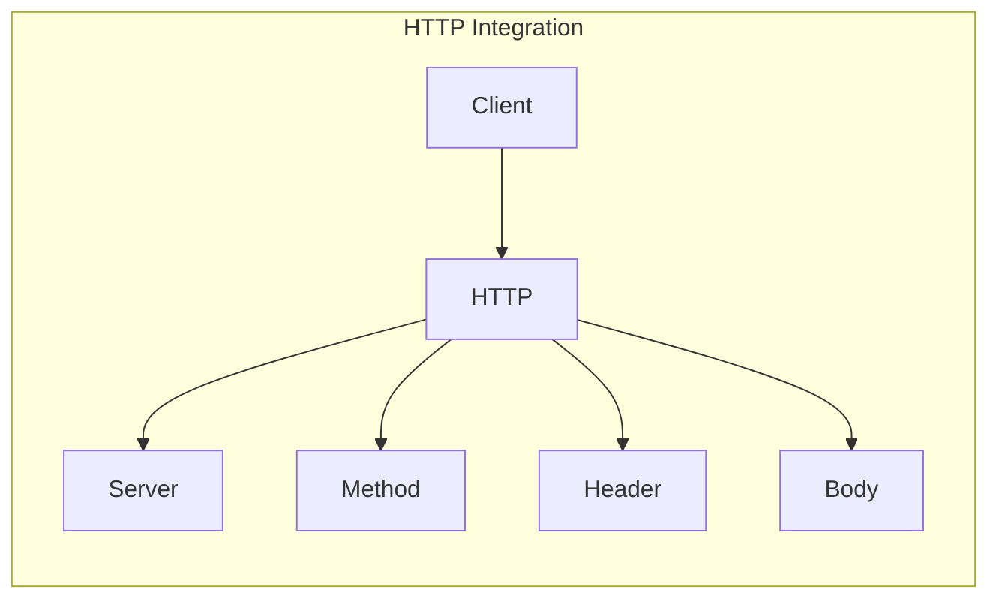
```mermaid
graph LR
    subgraph HTTP Integration
        Client[Client] --> HTTP[HTTP]
        HTTP --> Server[Server]
        
        HTTP --> Method[Method]
        HTTP --> Header[Header]
        HTTP --> Body[Body]
    end
```

**Integration Points:**
- Request handling
- Response formatting
- Header management
- Error handling

### 2. WebSocket Integration

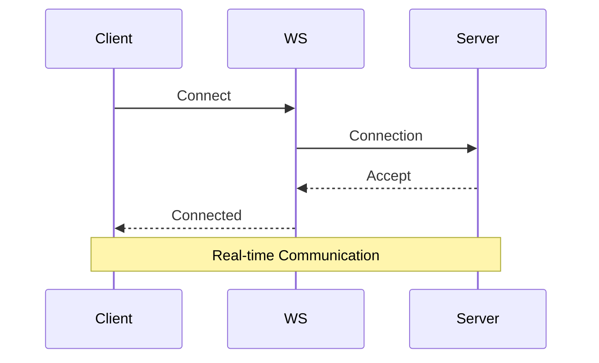
```mermaid
sequenceDiagram
    participant Client
    participant WS
    participant Server
    
    Client->>WS: Connect
    WS->>Server: Connection
    Server-->>WS: Accept
    WS-->>Client: Connected
    Note over Client,Server: Real-time Communication
```

**Integration Points:**
- Connection management
- Message handling
- Event processing
- Connection monitoring

### 3. GraphQL Integration

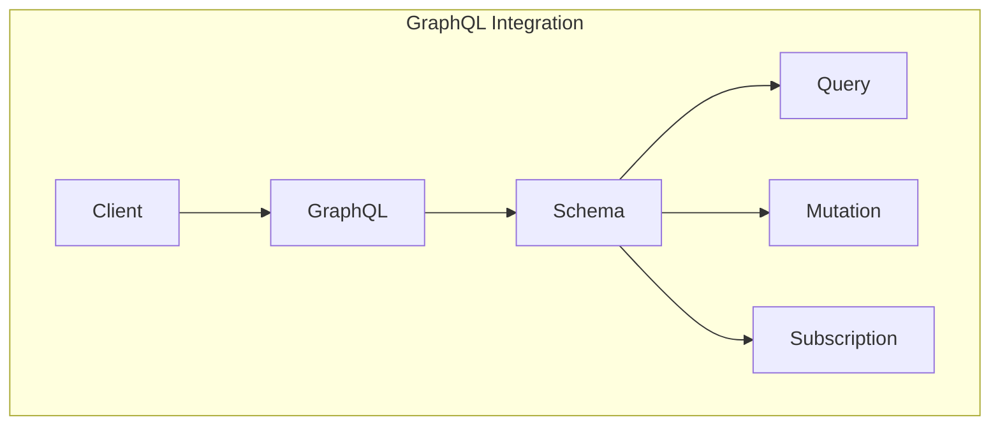
```mermaid
graph TB
    subgraph GraphQL Integration
        Client[Client] --> GraphQL[GraphQL]
        GraphQL --> Schema[Schema]
        
        Schema --> Query[Query]
        Schema --> Mutation[Mutation]
        Schema --> Subscription[Subscription]
    end
```

**Integration Points:**
- Schema definition
- Query execution
- Mutation handling
- Subscription management

## Security Integration

### 1. Encryption Integration

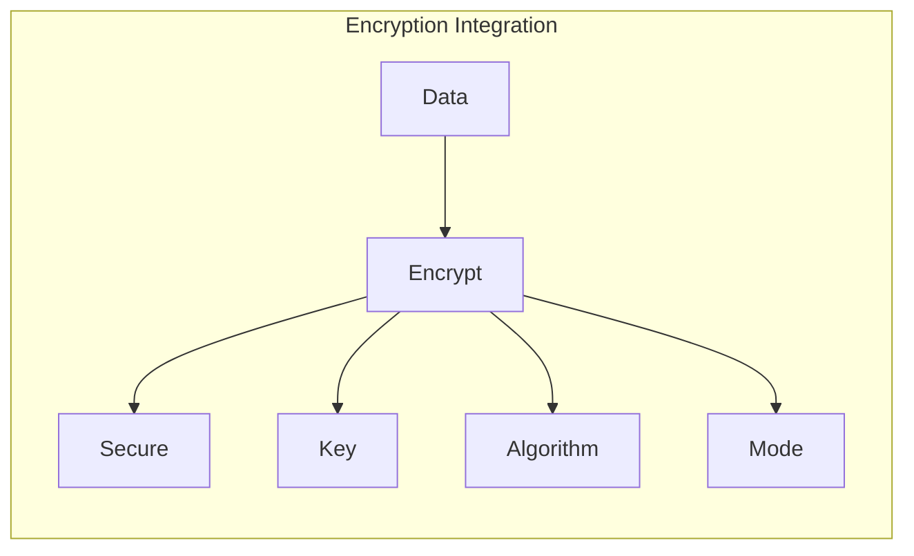
```mermaid
graph LR
    subgraph Encryption Integration
        Data[Data] --> Encrypt[Encrypt]
        Encrypt --> Secure[Secure]
        
        Encrypt --> Key[Key]
        Encrypt --> Algorithm[Algorithm]
        Encrypt --> Mode[Mode]
    end
```

**Integration Points:**
- Key management
- Encryption operations
- Decryption handling
- Security monitoring

### 2. Authentication Integration

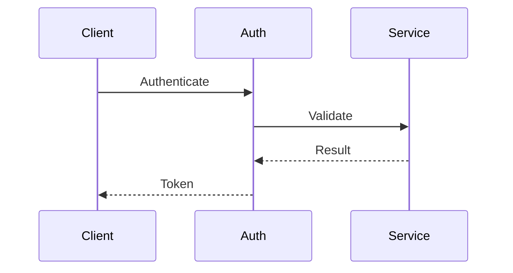
```mermaid
sequenceDiagram
    participant Client
    participant Auth
    participant Service
    
    Client->>Auth: Authenticate
    Auth->>Service: Validate
    Service-->>Auth: Result
    Auth-->>Client: Token
```

**Integration Points:**
- Authentication flow
- Token management
- Session handling
- Access control

### 3. Authorization Integration

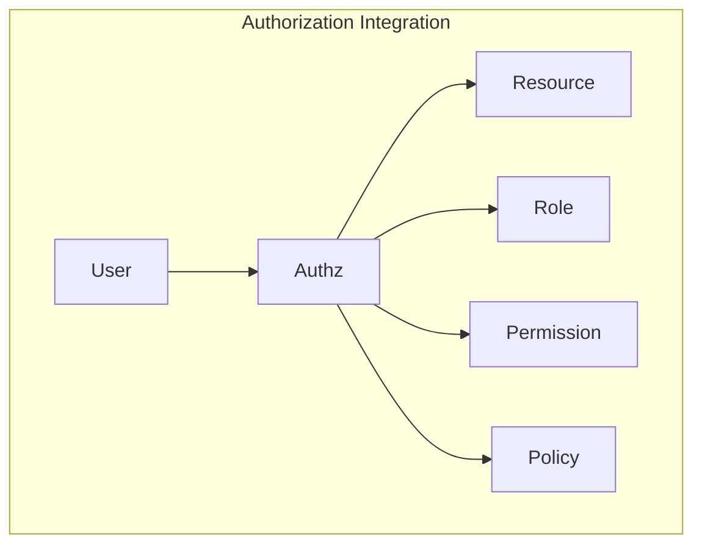
```mermaid
graph TB
    subgraph Authorization Integration
        User[User] --> Authz[Authz]
        Authz --> Resource[Resource]
        
        Authz --> Role[Role]
        Authz --> Permission[Permission]
        Authz --> Policy[Policy]
    end
```

**Integration Points:**
- Role management
- Permission handling
- Policy enforcement
- Access control

## Monitoring Integration

### 1. Metrics Integration

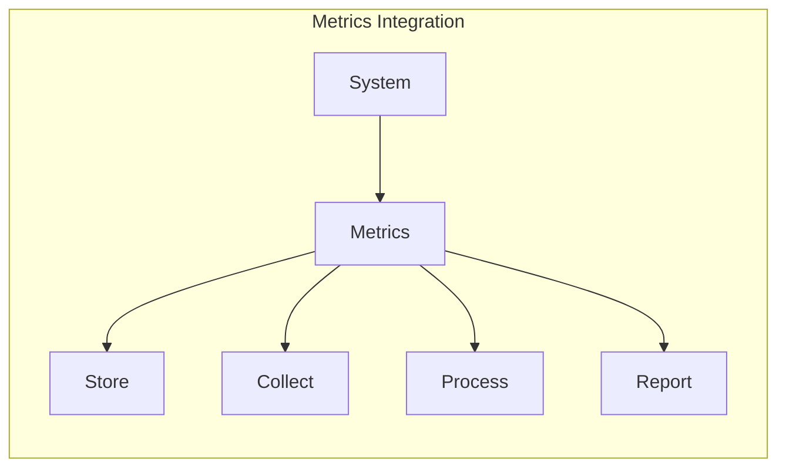
```mermaid
graph LR
    subgraph Metrics Integration
        System[System] --> Metrics[Metrics]
        Metrics --> Store[Store]
        
        Metrics --> Collect[Collect]
        Metrics --> Process[Process]
        Metrics --> Report[Report]
    end
```

**Integration Points:**
- Metric collection
- Data processing
- Storage management
- Reporting

### 2. Logging Integration

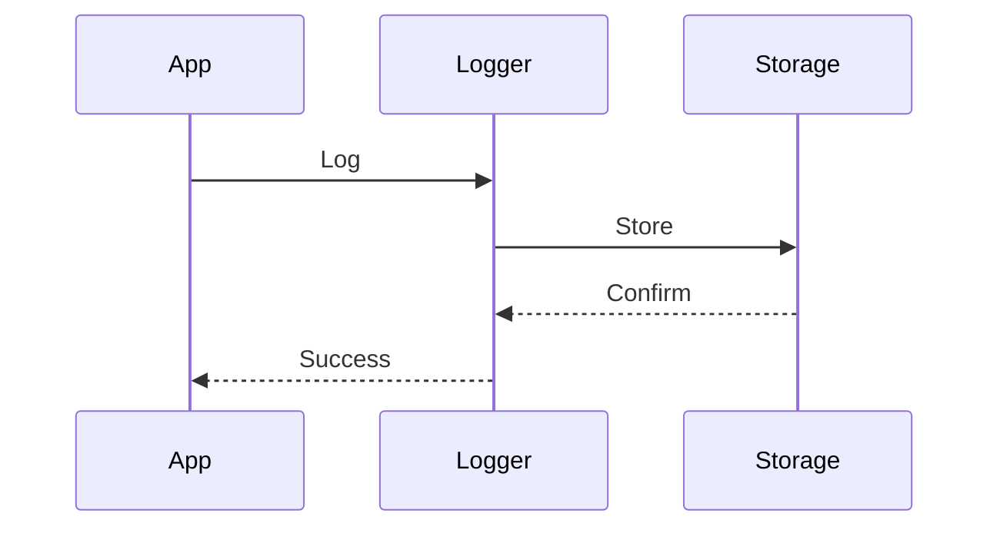
```mermaid
sequenceDiagram
    participant App
    participant Logger
    participant Storage
    
    App->>Logger: Log
    Logger->>Storage: Store
    Storage-->>Logger: Confirm
    Logger-->>App: Success
```

**Integration Points:**
- Log collection
- Log processing
- Log storage
- Log analysis

### 3. Alert Integration

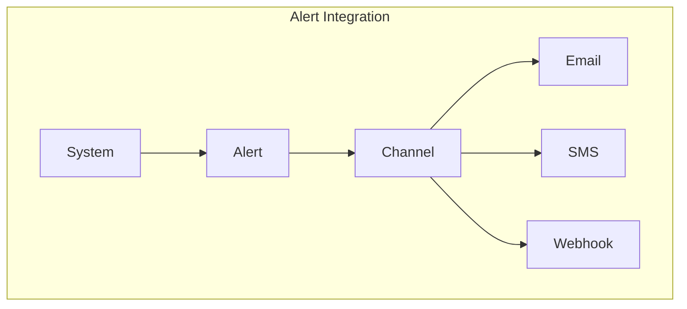
```mermaid
graph TB
    subgraph Alert Integration
        System[System] --> Alert[Alert]
        Alert --> Channel[Channel]
        
        Channel --> Email[Email]
        Channel --> SMS[SMS]
        Channel --> Webhook[Webhook]
    end
```

**Integration Points:**
- Alert configuration
- Channel management
- Notification delivery
- Status tracking 