# Data API Performance Optimization Documentation

## Caching Strategy

### 1. Multi-Level Cache

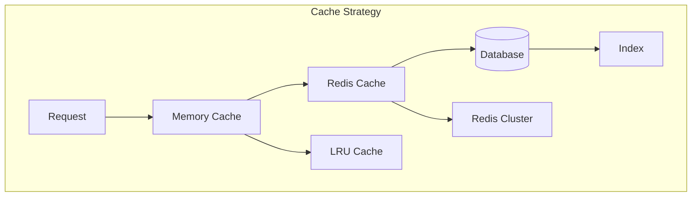
```mermaid
graph TB
    subgraph Cache Strategy
        Request[Request] --> Memory[Memory Cache]
        Memory --> Redis[Redis Cache]
        Redis --> DB[(Database)]
        
        Memory --> LRU[LRU Cache]
        Redis --> Cluster[Redis Cluster]
        DB --> Index[Index]
    end
```

**Optimization Points:**
- Memory cache for hot data
- Redis for distributed cache
- Database for persistent storage
- Index optimization

### 2. Cache Invalidation

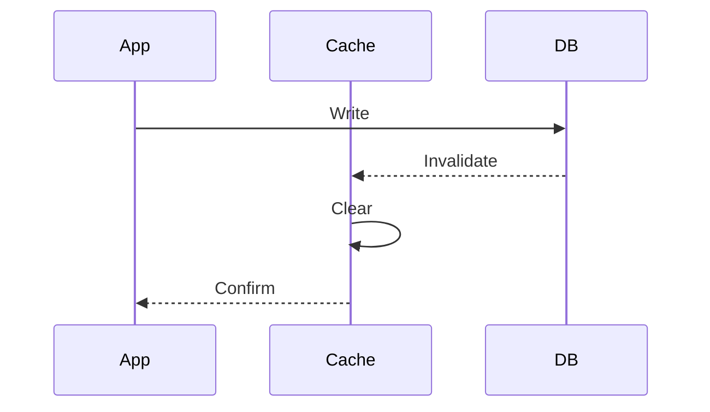
```mermaid
sequenceDiagram
    participant App
    participant Cache
    participant DB
    
    App->>DB: Write
    DB-->>Cache: Invalidate
    Cache->>Cache: Clear
    Cache-->>App: Confirm
```

**Optimization Points:**
- Write-through cache
- Cache invalidation
- Cache consistency
- Cache warming

### 3. Cache Distribution

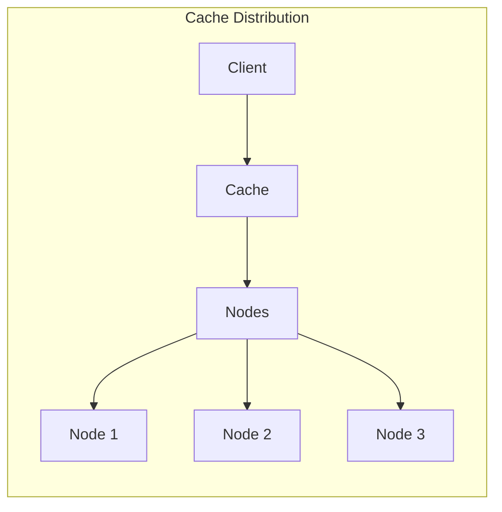
```mermaid
graph LR
    subgraph Cache Distribution
        Client[Client] --> Cache[Cache]
        Cache --> Nodes[Nodes]
        
        Nodes --> Node1[Node 1]
        Nodes --> Node2[Node 2]
        Nodes --> Node3[Node 3]
    end
```

**Optimization Points:**
- Load balancing
- Data distribution
- Node management
- Failover handling

## Query Optimization

### 1. Query Planning

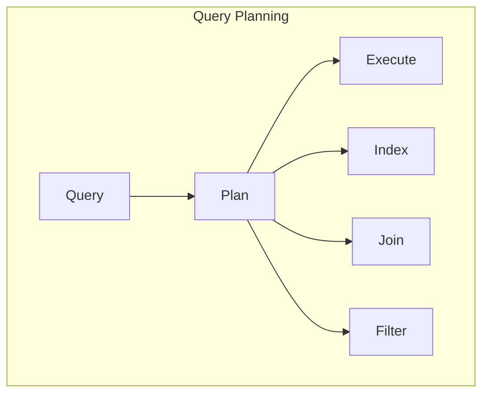
```mermaid
graph TB
    subgraph Query Planning
        Query[Query] --> Plan[Plan]
        Plan --> Execute[Execute]
        
        Plan --> Index[Index]
        Plan --> Join[Join]
        Plan --> Filter[Filter]
    end
```

**Optimization Points:**
- Query analysis
- Execution plan
- Index usage
- Join optimization

### 2. Index Strategy

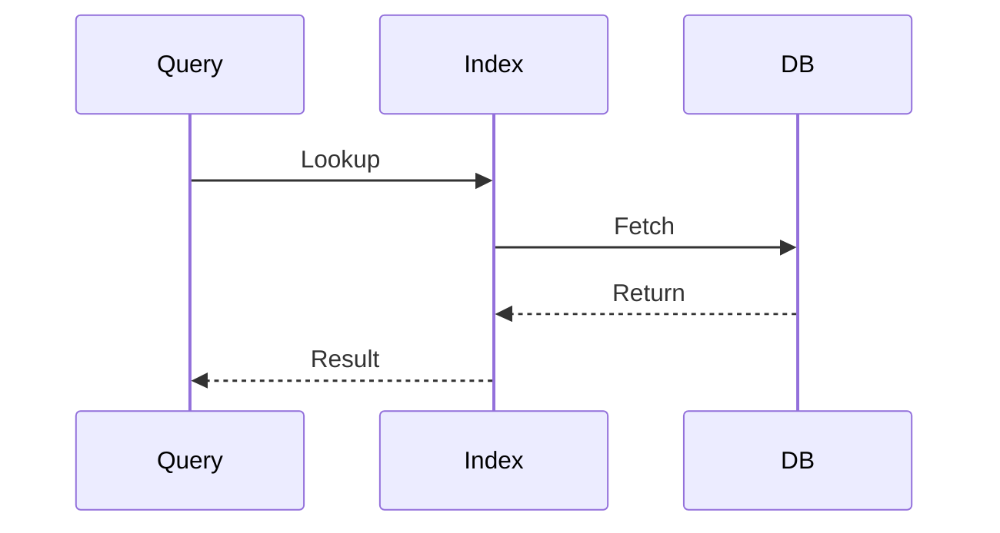
```mermaid
sequenceDiagram
    participant Query
    participant Index
    participant DB
    
    Query->>Index: Lookup
    Index->>DB: Fetch
    DB-->>Index: Return
    Index-->>Query: Result
```

**Optimization Points:**
- Index selection
- Index maintenance
- Index coverage
- Index size

### 3. Query Caching

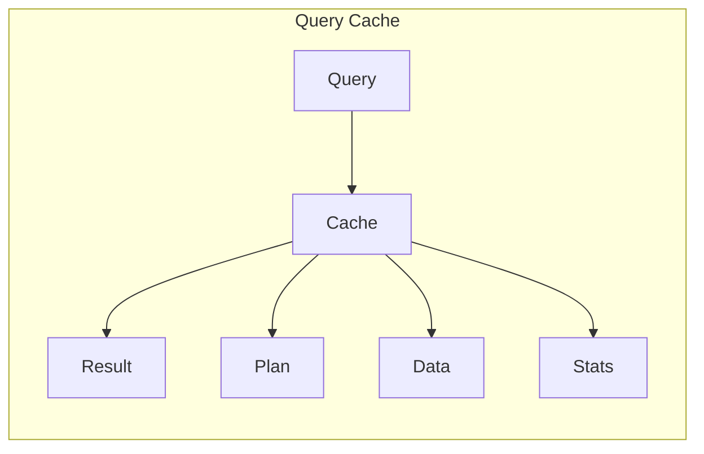
```mermaid
graph LR
    subgraph Query Cache
        Query[Query] --> Cache[Cache]
        Cache --> Result[Result]
        
        Cache --> Plan[Plan]
        Cache --> Data[Data]
        Cache --> Stats[Stats]
    end
```

**Optimization Points:**
- Query cache
- Result cache
- Plan cache
- Statistics cache

## Data Processing Optimization

### 1. Batch Processing

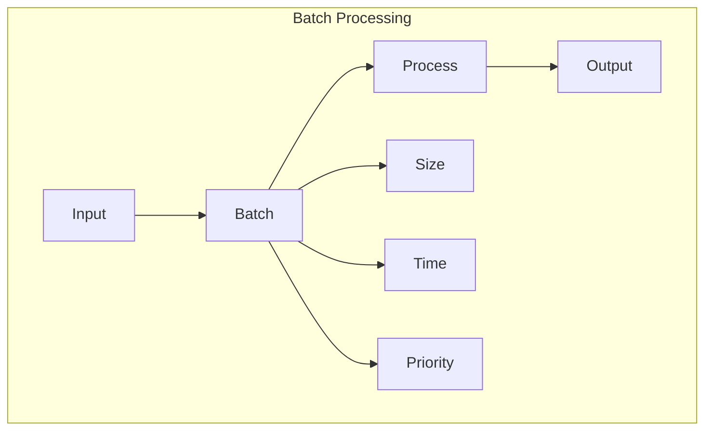
```mermaid
graph TB
    subgraph Batch Processing
        Input[Input] --> Batch[Batch]
        Batch --> Process[Process]
        Process --> Output[Output]
        
        Batch --> Size[Size]
        Batch --> Time[Time]
        Batch --> Priority[Priority]
    end
```

**Optimization Points:**
- Batch size
- Processing time
- Priority handling
- Resource usage

### 2. Stream Processing

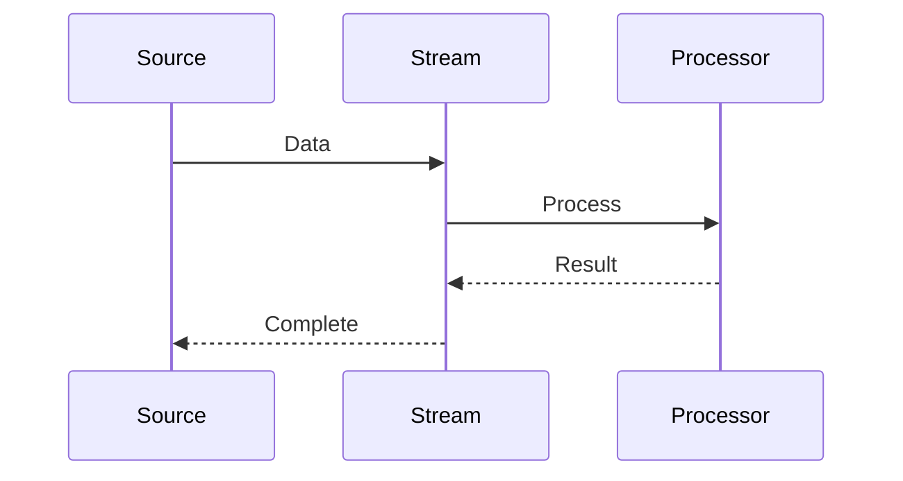
```mermaid
sequenceDiagram
    participant Source
    participant Stream
    participant Processor
    
    Source->>Stream: Data
    Stream->>Processor: Process
    Processor-->>Stream: Result
    Stream-->>Source: Complete
```

**Optimization Points:**
- Stream buffering
- Processing rate
- Backpressure
- Resource allocation

### 3. Parallel Processing

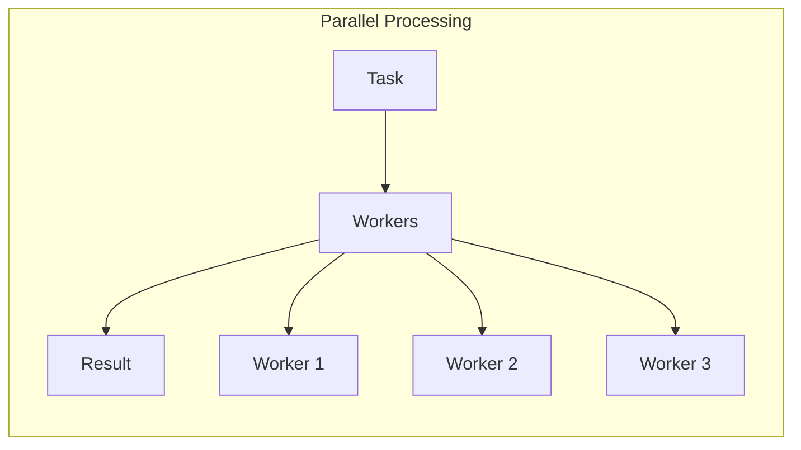
```mermaid
graph LR
    subgraph Parallel Processing
        Task[Task] --> Workers[Workers]
        Workers --> Result[Result]
        
        Workers --> Worker1[Worker 1]
        Workers --> Worker2[Worker 2]
        Workers --> Worker3[Worker 3]
    end
```

**Optimization Points:**
- Worker pool
- Task distribution
- Result aggregation
- Resource management

## Network Optimization

### 1. Connection Pooling

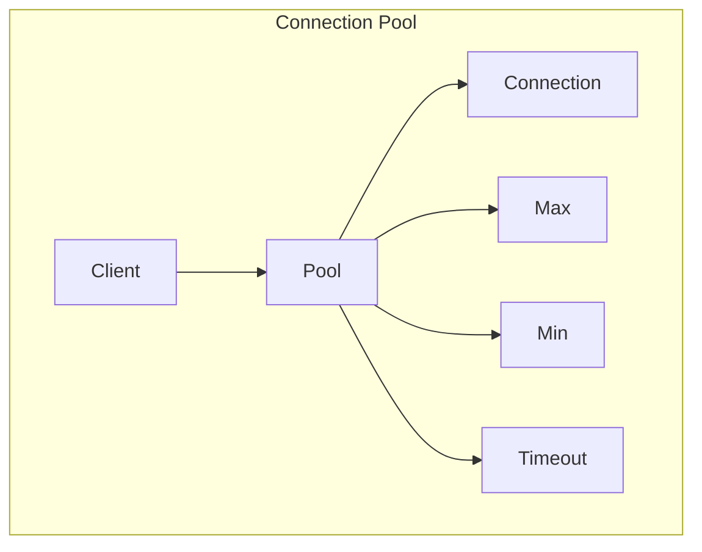
```mermaid
graph TB
    subgraph Connection Pool
        Client[Client] --> Pool[Pool]
        Pool --> Connection[Connection]
        
        Pool --> Max[Max]
        Pool --> Min[Min]
        Pool --> Timeout[Timeout]
    end
```

**Optimization Points:**
- Pool size
- Connection reuse
- Timeout handling
- Resource cleanup

### 2. Compression

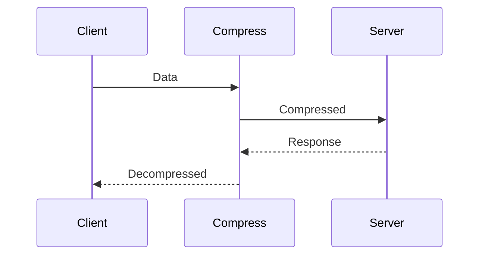
```mermaid
sequenceDiagram
    participant Client
    participant Compress
    participant Server
    
    Client->>Compress: Data
    Compress->>Server: Compressed
    Server-->>Compress: Response
    Compress-->>Client: Decompressed
```

**Optimization Points:**
- Compression ratio
- Algorithm selection
- CPU usage
- Memory usage

### 3. Load Balancing

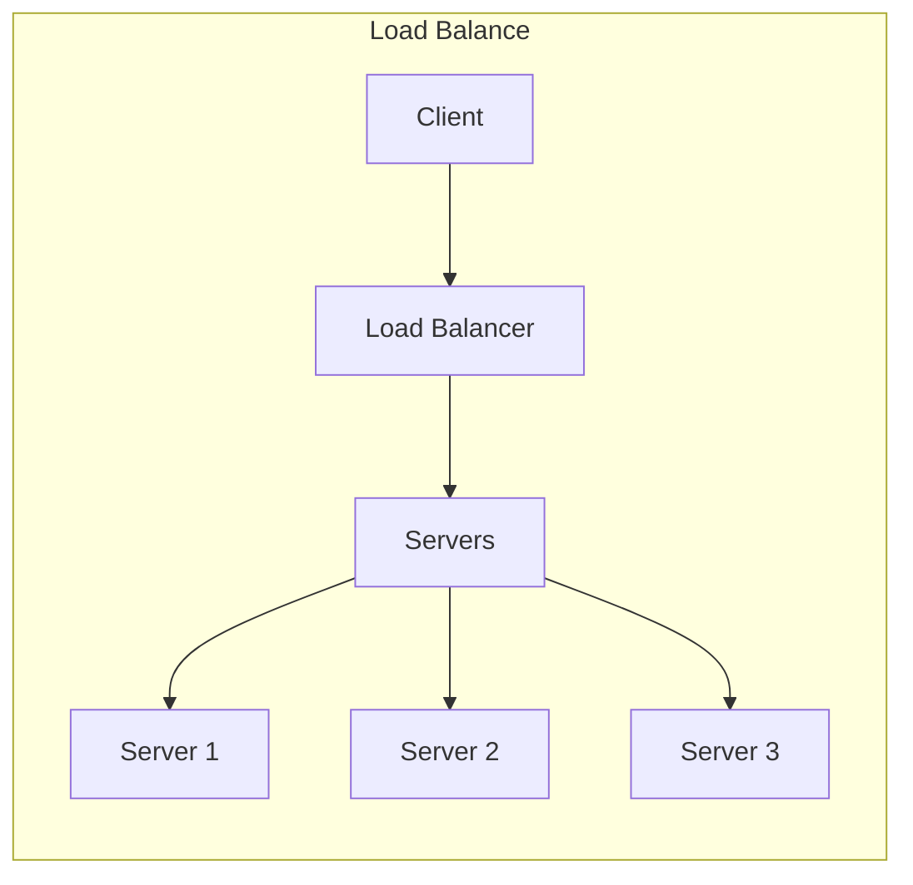
```mermaid
graph LR
    subgraph Load Balance
        Client[Client] --> LB[Load Balancer]
        LB --> Servers[Servers]
        
        Servers --> Server1[Server 1]
        Servers --> Server2[Server 2]
        Servers --> Server3[Server 3]
    end
```

**Optimization Points:**
- Load distribution
- Health checking
- Failover
- Session management

## Resource Optimization

### 1. Memory Management

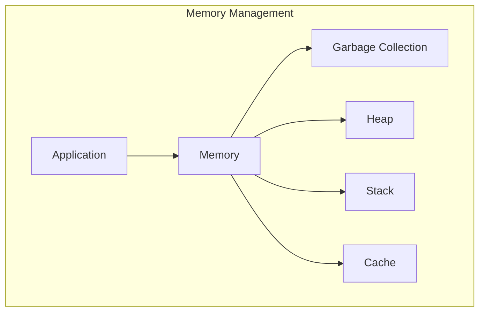
```mermaid
graph TB
    subgraph Memory Management
        App[Application] --> Memory[Memory]
        Memory --> GC[Garbage Collection]
        
        Memory --> Heap[Heap]
        Memory --> Stack[Stack]
        Memory --> Cache[Cache]
    end
```

**Optimization Points:**
- Memory allocation
- Garbage collection
- Memory leaks
- Cache size

### 2. CPU Optimization

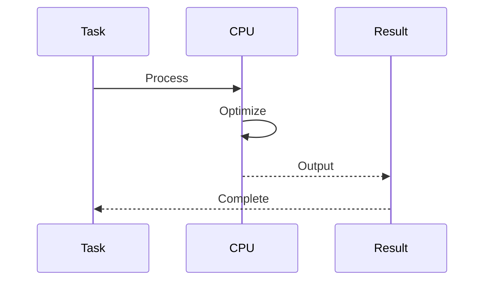
```mermaid
sequenceDiagram
    participant Task
    participant CPU
    participant Result
    
    Task->>CPU: Process
    CPU->>CPU: Optimize
    CPU-->>Result: Output
    Result-->>Task: Complete
```

**Optimization Points:**
- CPU usage
- Thread management
- Process scheduling
- Resource allocation

### 3. I/O Optimization

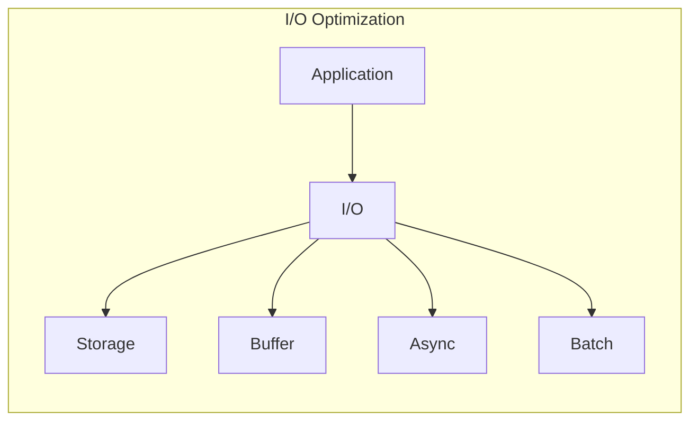
```mermaid
graph LR
    subgraph I/O Optimization
        App[Application] --> IO[I/O]
        IO --> Storage[Storage]
        
        IO --> Buffer[Buffer]
        IO --> Async[Async]
        IO --> Batch[Batch]
    end
```

**Optimization Points:**
- I/O buffering
- Async operations
- Batch I/O
- Resource utilization

## Monitoring and Tuning

### 1. Performance Monitoring

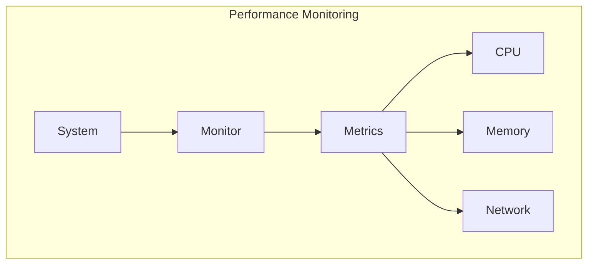
```mermaid
graph TB
    subgraph Performance Monitoring
        System[System] --> Monitor[Monitor]
        Monitor --> Metrics[Metrics]
        
        Metrics --> CPU[CPU]
        Metrics --> Memory[Memory]
        Metrics --> Network[Network]
    end
```

**Optimization Points:**
- Metric collection
- Threshold monitoring
- Alert management
- Performance analysis

### 2. Resource Tuning

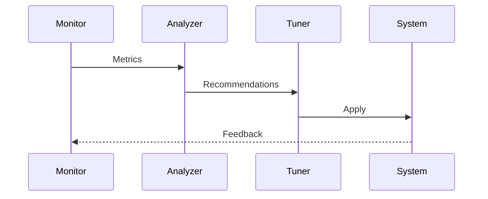
```mermaid
sequenceDiagram
    participant Monitor
    participant Analyzer
    participant Tuner
    
    Monitor->>Analyzer: Metrics
    Analyzer->>Tuner: Recommendations
    Tuner->>System: Apply
    System-->>Monitor: Feedback
```

**Optimization Points:**
- Resource analysis
- Tuning recommendations
- Configuration changes
- Impact assessment

### 3. Bottleneck Detection

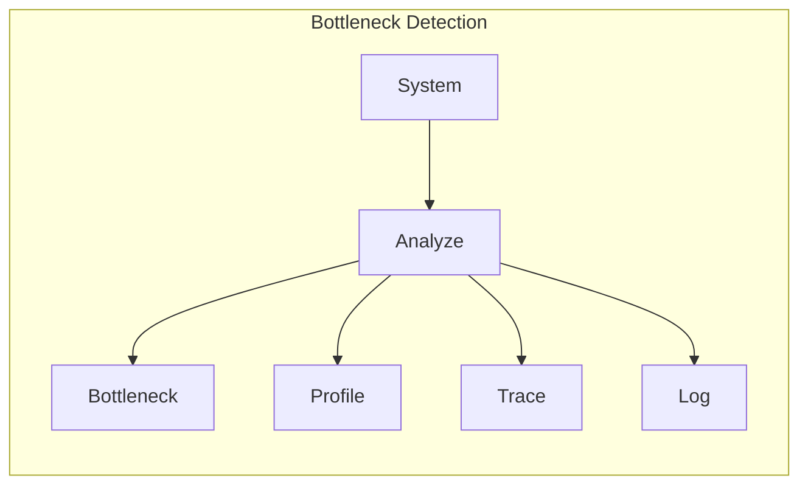
```mermaid
graph LR
    subgraph Bottleneck Detection
        System[System] --> Analyze[Analyze]
        Analyze --> Bottleneck[Bottleneck]
        
        Analyze --> Profile[Profile]
        Analyze --> Trace[Trace]
        Analyze --> Log[Log]
    end
```

**Optimization Points:**
- Performance profiling
- Request tracing
- Log analysis
- Bottleneck resolution 