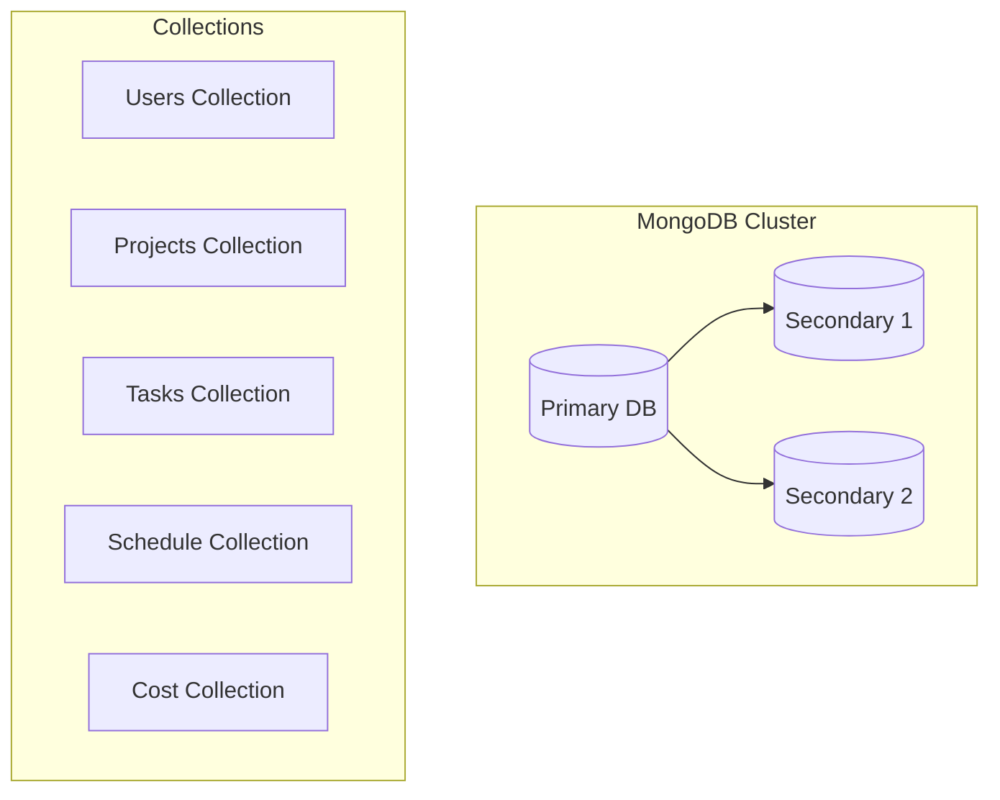
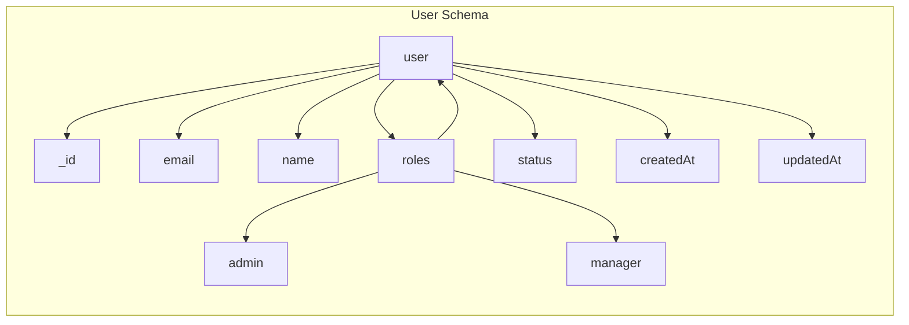
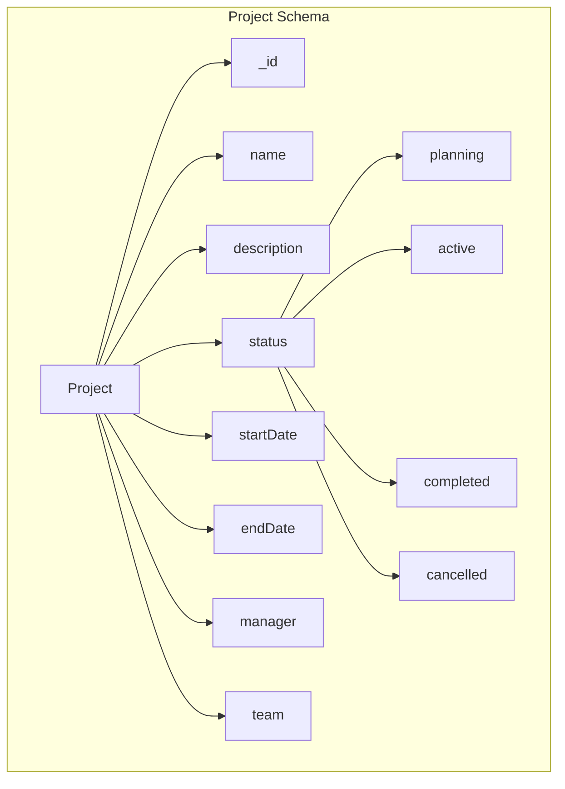
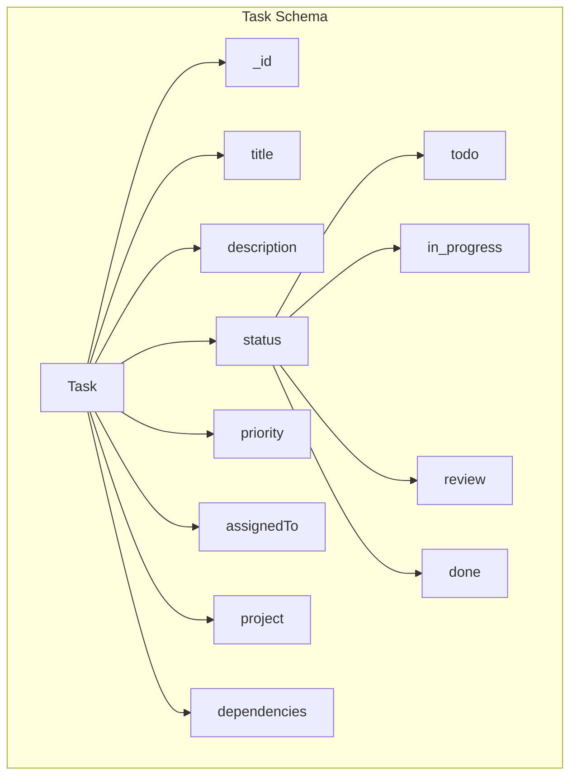
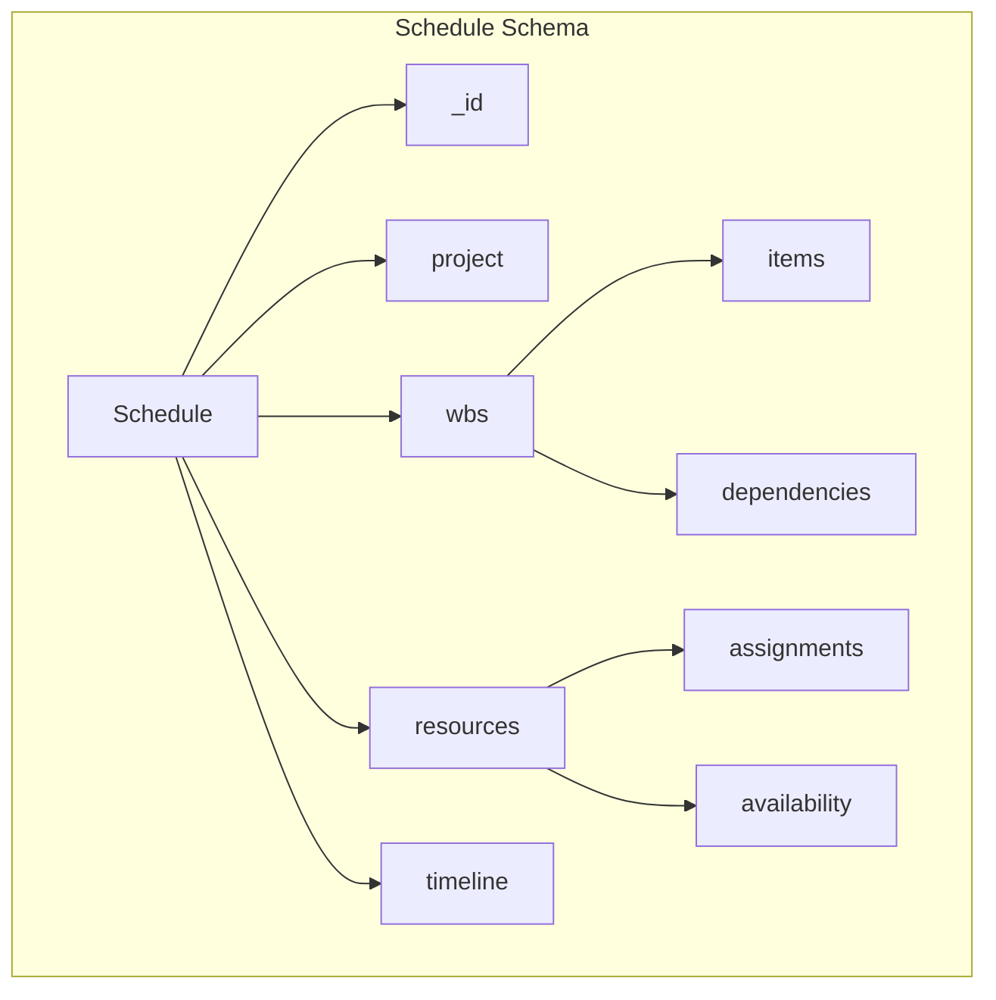
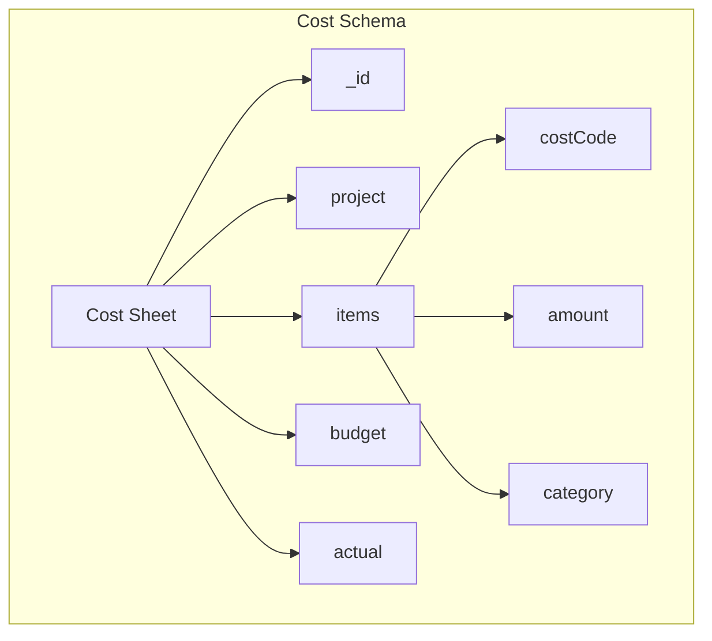
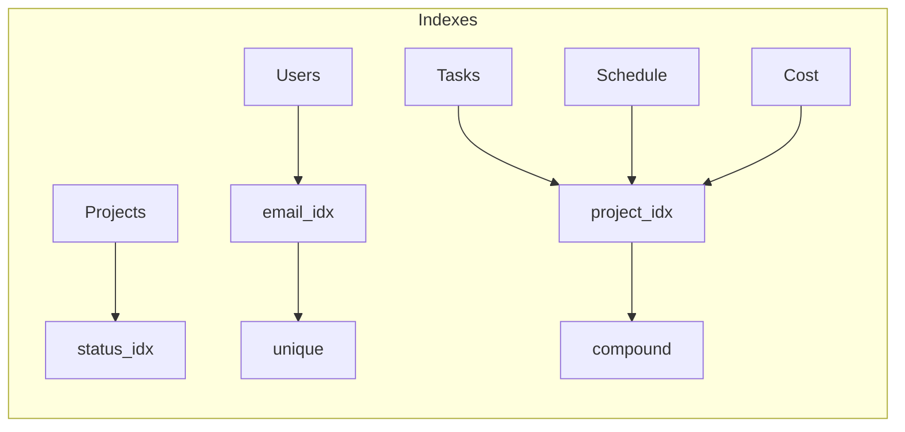
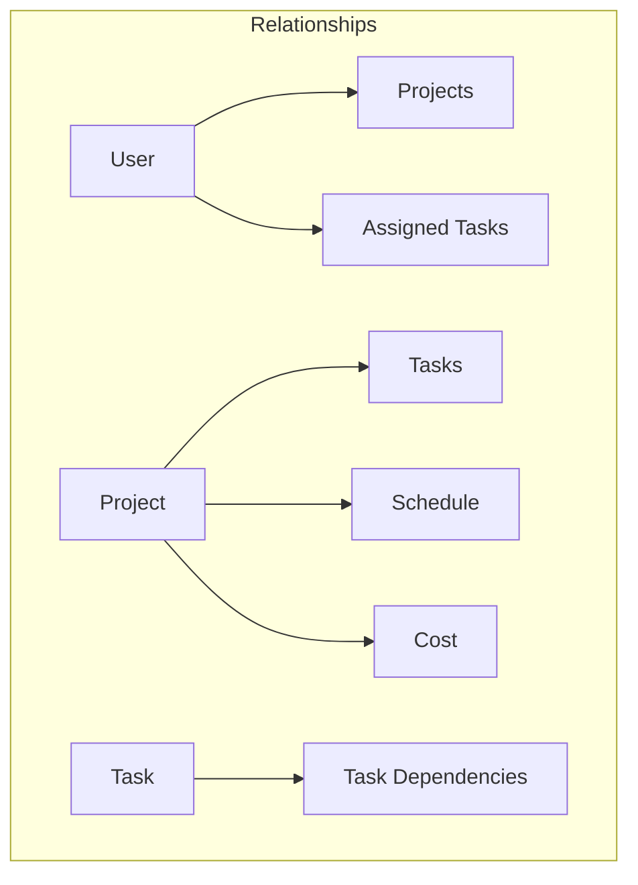
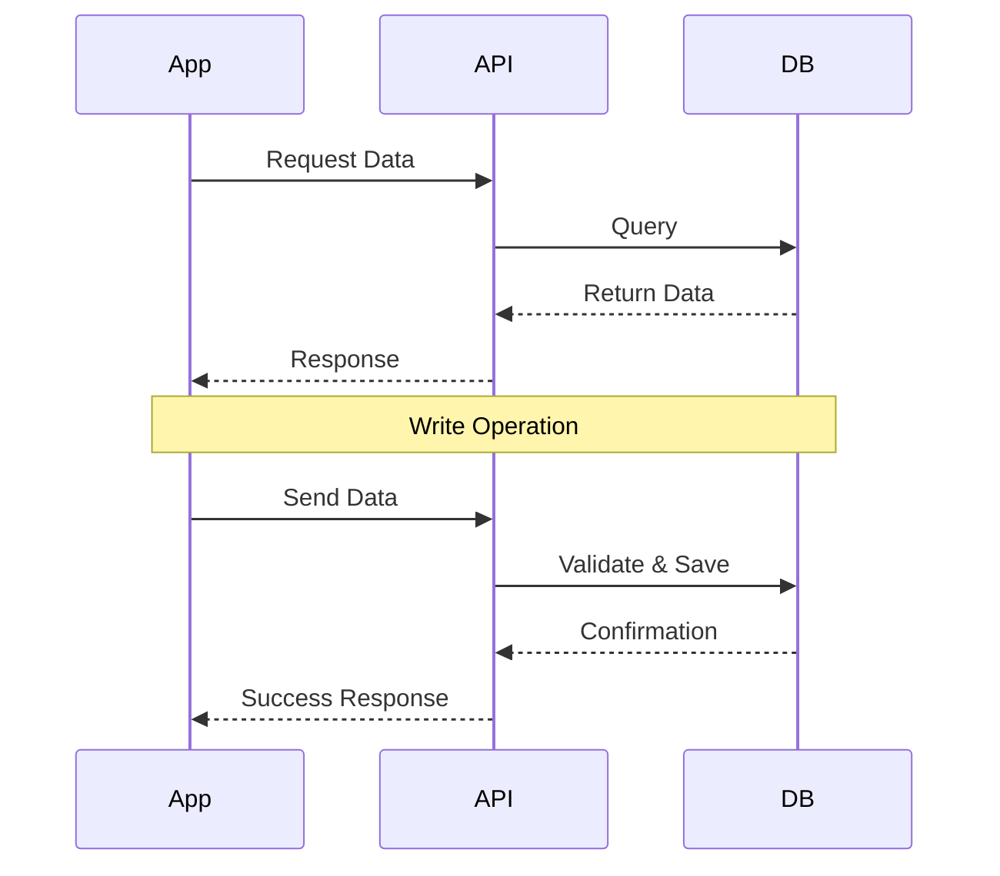

# Database Schema

## Database Architecture



## Collection Schemas

### 1. Users Collection



#### Schema Definition
```typescript
interface User {
  _id: ObjectId;
  email: string;
  name: string;
  roles: string[];
  status: 'active' | 'inactive';
  createdAt: Date;
  updatedAt: Date;
}
```

### 2. Projects Collection



#### Schema Definition
```typescript
interface Project {
  _id: ObjectId;
  name: string;
  description: string;
  status: 'planning' | 'active' | 'completed' | 'cancelled';
  startDate: Date;
  endDate: Date;
  manager: ObjectId; // Reference to User
  team: ObjectId[]; // References to Users
}
```

### 3. Tasks Collection



#### Schema Definition
```typescript
interface Task {
  _id: ObjectId;
  title: string;
  description: string;
  status: 'todo' | 'in_progress' | 'review' | 'done';
  priority: 'low' | 'medium' | 'high';
  assignedTo: ObjectId; // Reference to User
  project: ObjectId; // Reference to Project
  dependencies: ObjectId[]; // References to Tasks
}
```

### 4. Schedule Collection



#### Schema Definition
```typescript
interface Schedule {
  _id: ObjectId;
  project: ObjectId; // Reference to Project
  wbs: {
    items: WBSItem[];
    dependencies: WBSDependency[];
  };
  resources: {
    assignments: ResourceAssignment[];
    availability: ResourceAvailability[];
  };
  timeline: {
    startDate: Date;
    endDate: Date;
    milestones: Milestone[];
  };
}
```

### 5. Cost Collection



#### Schema Definition
```typescript
interface CostSheet {
  _id: ObjectId;
  project: ObjectId; // Reference to Project
  items: {
    costCode: string;
    amount: number;
    category: string;
  }[];
  budget: {
    total: number;
    breakdown: Record<string, number>;
  };
  actual: {
    total: number;
    breakdown: Record<string, number>;
  };
}
```

## Database Indexes



## Database Relationships



## Data Flow

