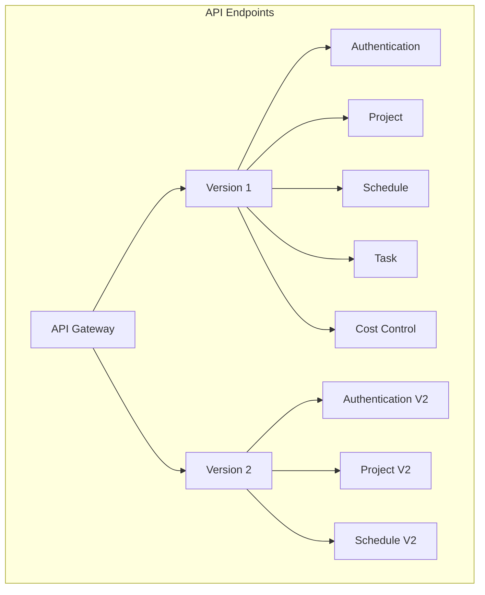
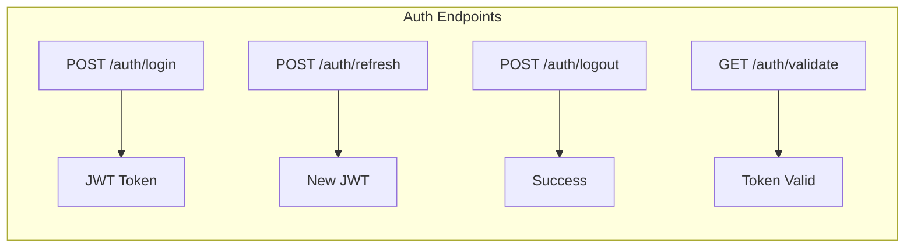
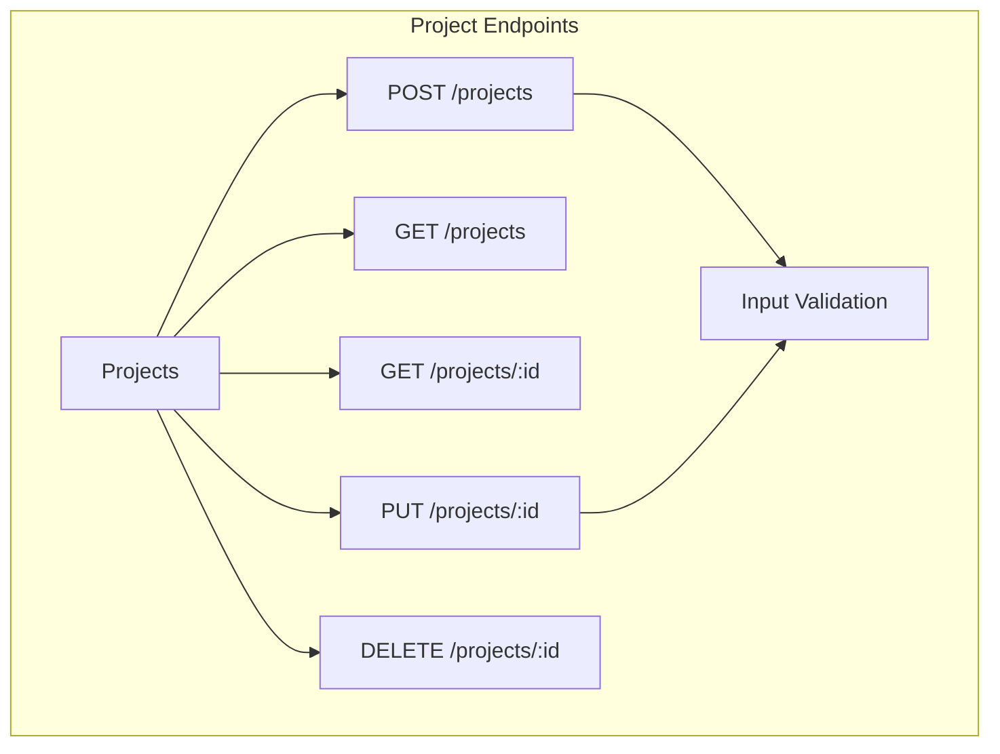
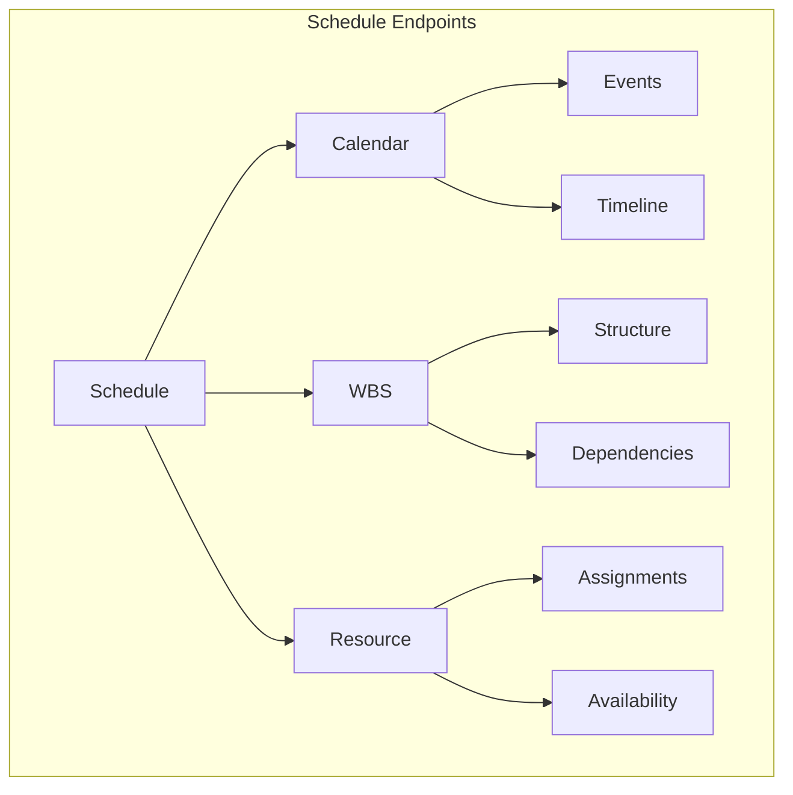
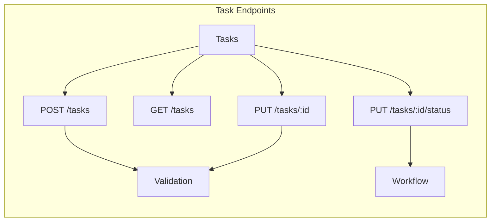
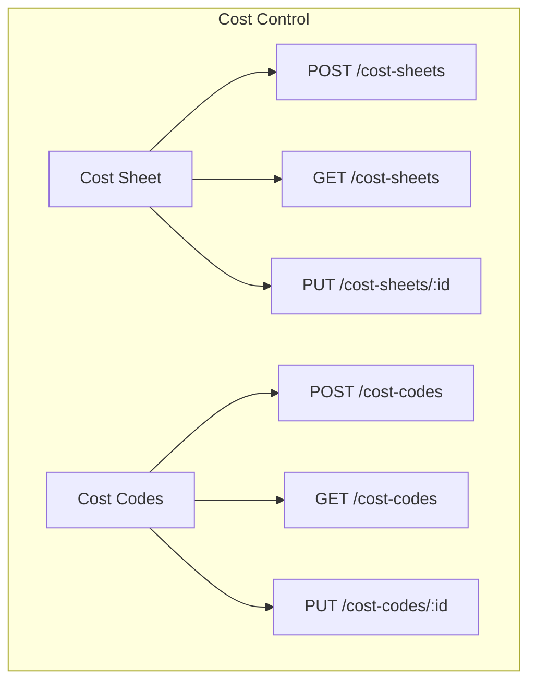
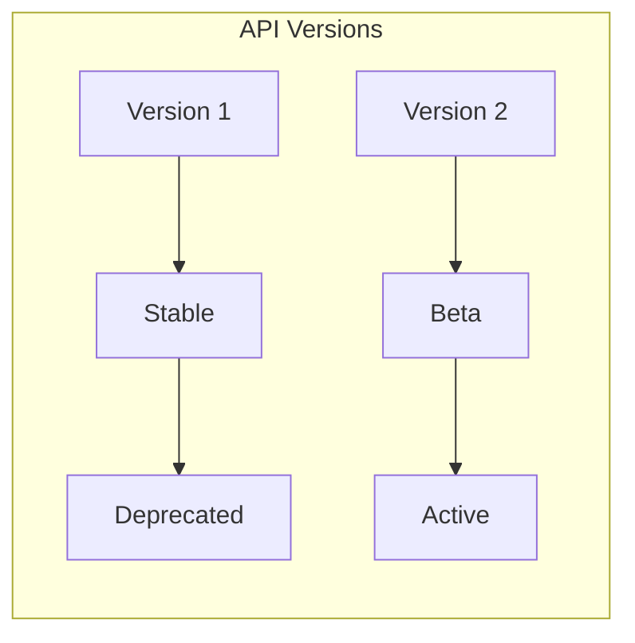

# API Endpoints

## API Structure



## Endpoint Categories

### 1. Authentication Endpoints



#### Authentication Routes
- `POST /api/v1/auth/login` - User login
- `POST /api/v1/auth/refresh` - Refresh token
- `POST /api/v1/auth/logout` - User logout
- `GET /api/v1/auth/validate` - Validate token

### 2. Project Endpoints



#### Project Routes
- `POST /api/v1/projects` - Create project
- `GET /api/v1/projects` - List projects
- `GET /api/v1/projects/:id` - Get project
- `PUT /api/v1/projects/:id` - Update project
- `DELETE /api/v1/projects/:id` - Delete project

### 3. Schedule Endpoints



#### Schedule Routes
- `GET /api/v1/schedule/calendar` - Get calendar
- `POST /api/v1/schedule/events` - Create event
- `GET /api/v1/schedule/wbs` - Get WBS
- `POST /api/v1/schedule/wbs` - Create WBS item
- `GET /api/v1/schedule/resources` - List resources
- `POST /api/v1/schedule/assignments` - Create assignment

### 4. Task Endpoints



#### Task Routes
- `POST /api/v1/tasks` - Create task
- `GET /api/v1/tasks` - List tasks
- `PUT /api/v1/tasks/:id` - Update task
- `PUT /api/v1/tasks/:id/status` - Update task status

### 5. Cost Control Endpoints



#### Cost Control Routes
- `POST /api/v1/cost-sheets` - Create cost sheet
- `GET /api/v1/cost-sheets` - List cost sheets
- `PUT /api/v1/cost-sheets/:id` - Update cost sheet
- `POST /api/v1/cost-codes` - Create cost code
- `GET /api/v1/cost-codes` - List cost codes
- `PUT /api/v1/cost-codes/:id` - Update cost code

## API Versioning



## Response Format

```json
{
  "success": true,
  "data": {
    // Response data
  },
  "meta": {
    "timestamp": "2024-03-13T12:00:00Z",
    "requestId": "uuid",
    "version": "1.0"
  },
  "error": null
}
```

## Error Format

```json
{
  "success": false,
  "data": null,
  "meta": {
    "timestamp": "2024-03-13T12:00:00Z",
    "requestId": "uuid",
    "version": "1.0"
  },
  "error": {
    "code": "ERROR_CODE",
    "message": "Error message",
    "details": {
      // Additional error details
    }
  }
}
``` 