# Integration Points

## Integration Architecture

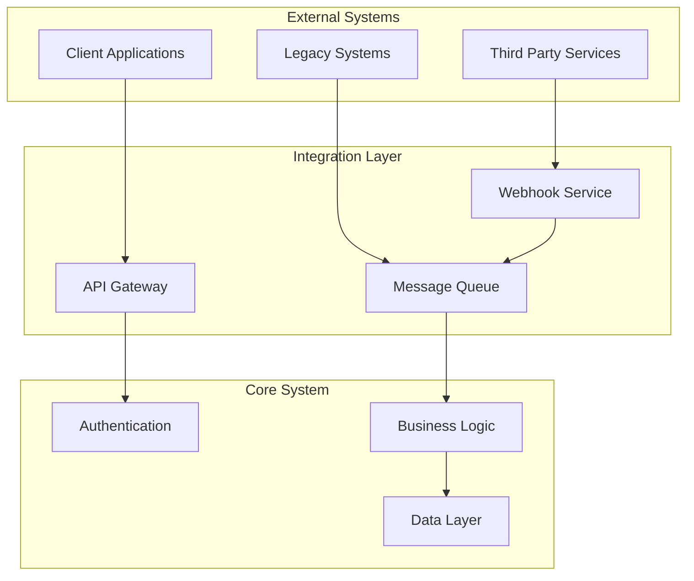

## Integration Methods

### 1. REST API Integration

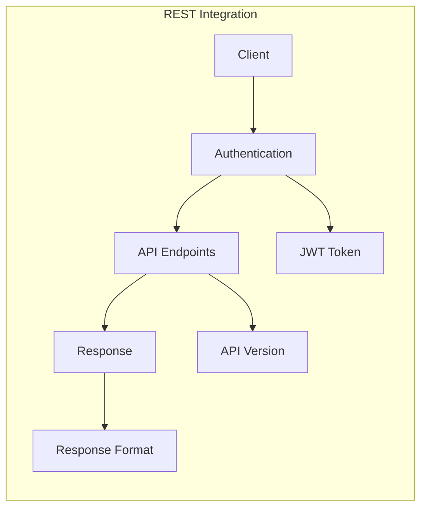

#### Authentication
- JWT-based authentication
- Token refresh mechanism
- Role-based access control

#### API Versioning
- URI-based versioning
- Version compatibility
- Deprecation policy

### 2. Webhook Integration

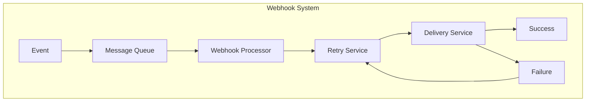

#### Webhook Events
- Project updates
- Task status changes
- Schedule modifications
- Cost updates

#### Webhook Configuration
- Event subscription
- Endpoint configuration
- Security settings
- Retry policies

### 3. Message Queue Integration

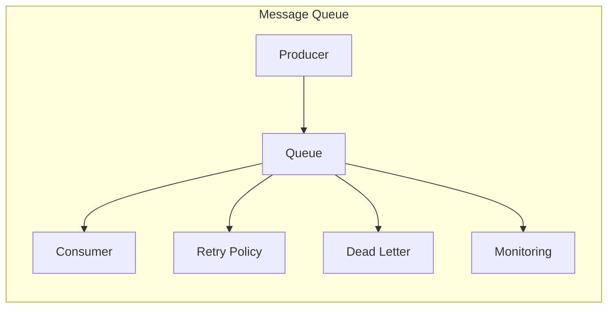

#### Queue Features
- Asynchronous processing
- Message persistence
- Error handling
- Monitoring

### 4. Data Synchronization

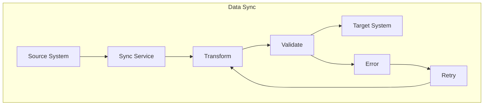

#### Sync Features
- Real-time sync
- Batch processing
- Conflict resolution
- Data validation

## Integration Patterns

### 1. Request-Response Pattern

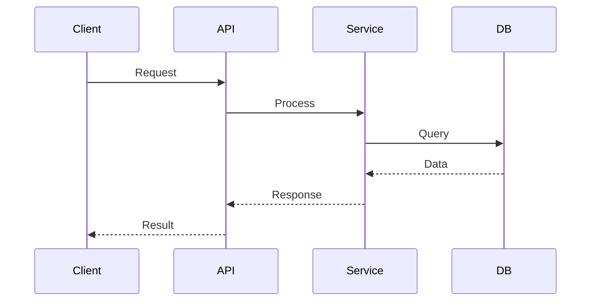

### 2. Event-Driven Pattern

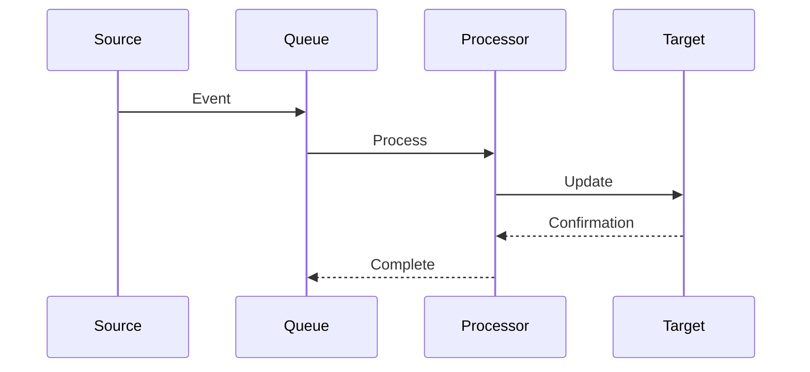

### 3. Batch Processing Pattern

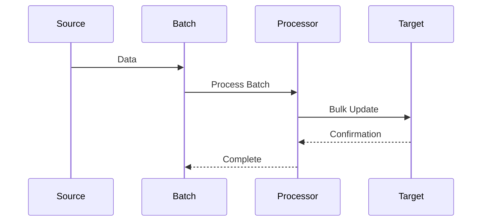

## Integration Security

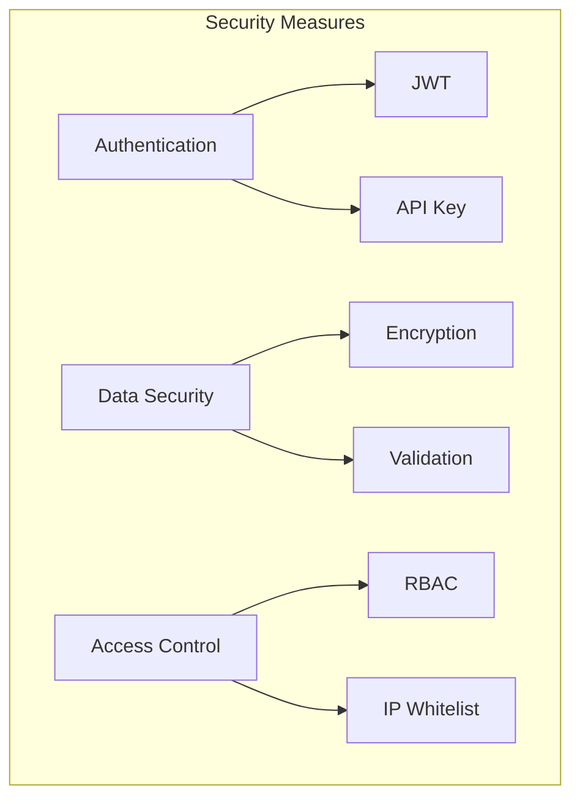

## Integration Monitoring

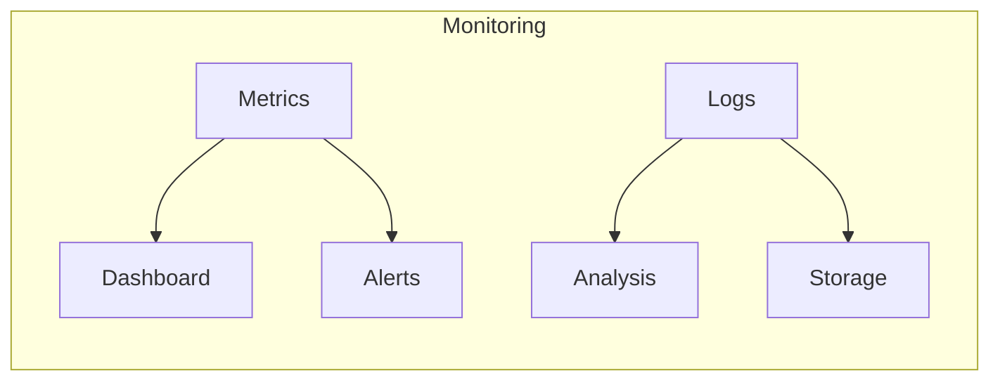

## Integration Testing

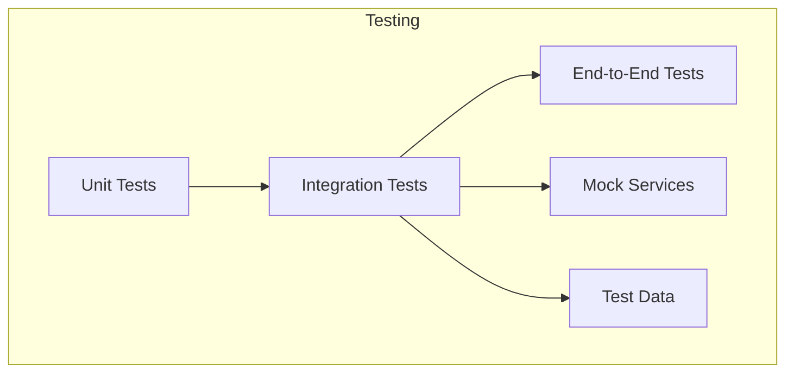