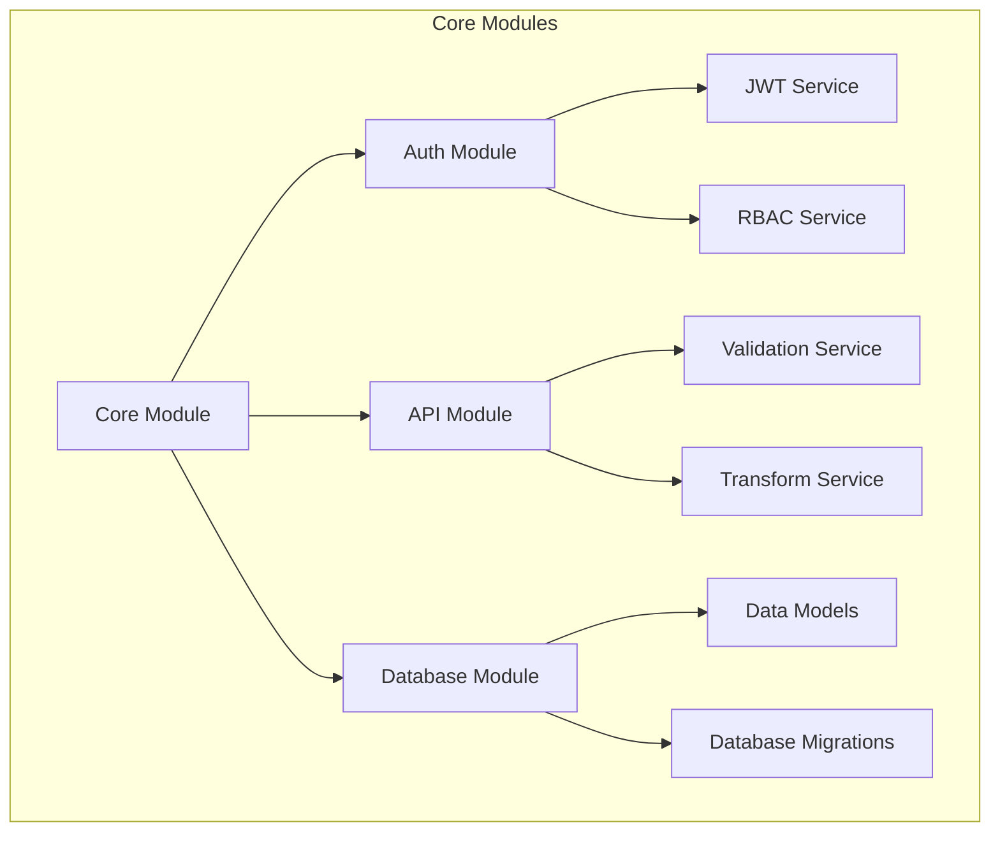
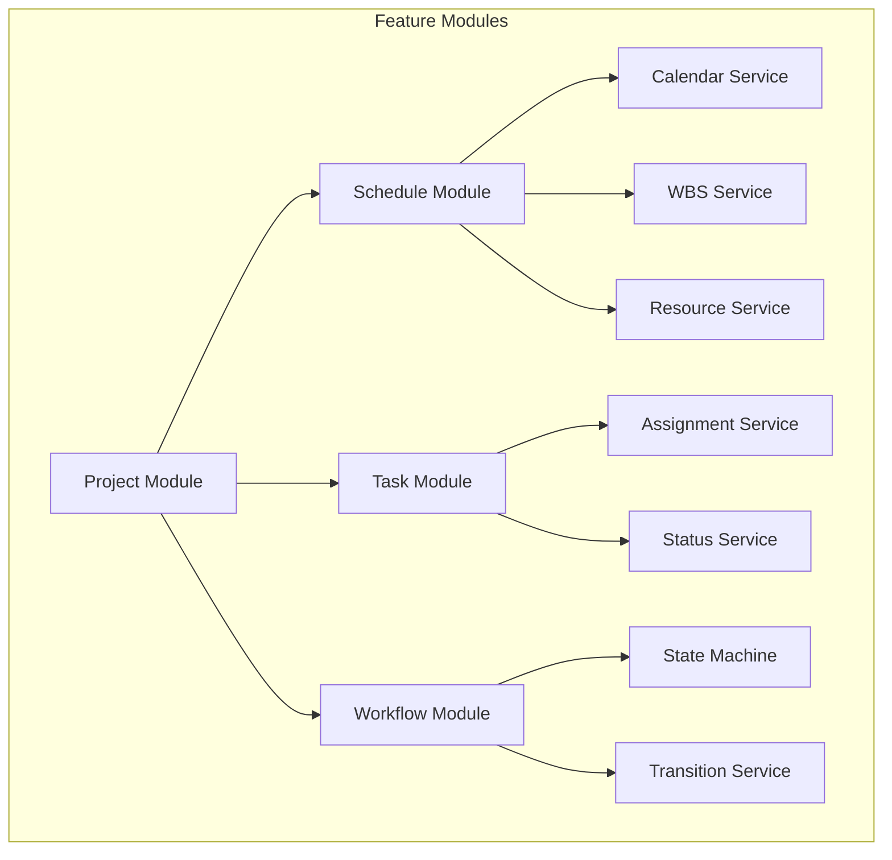
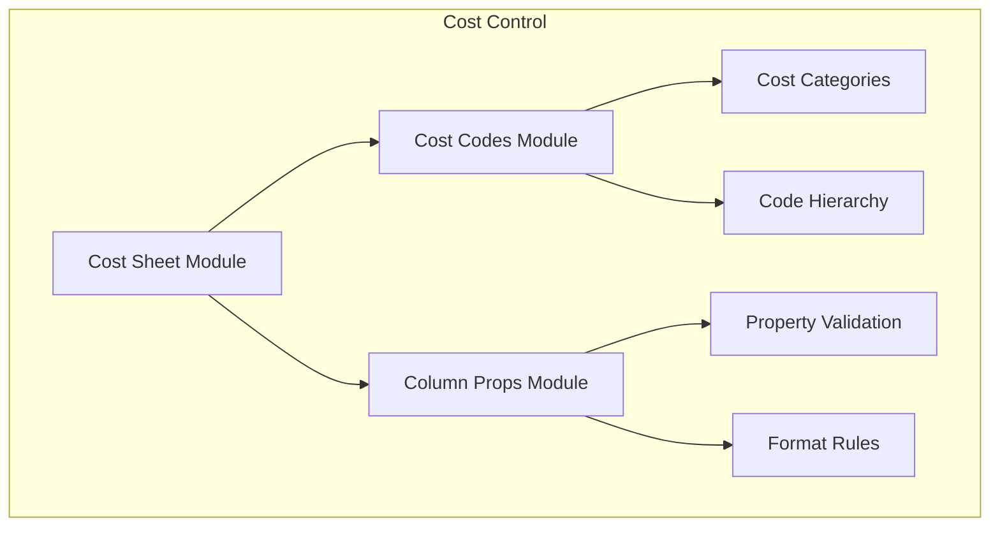
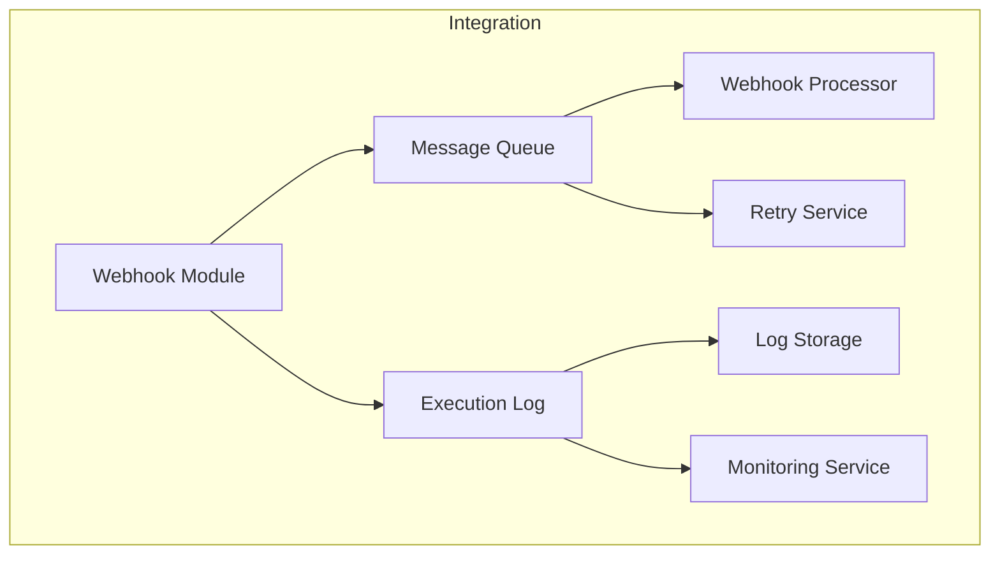
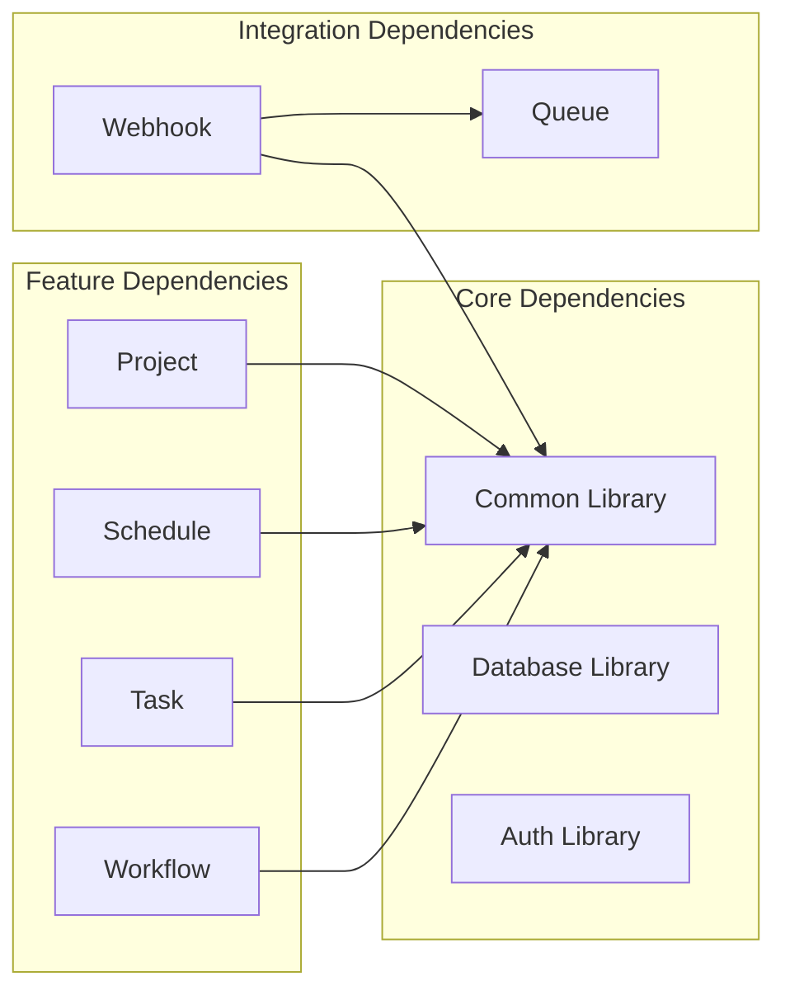

# Module Structure

## Core Modules

### Core Module
- Central module for core functionality
- Provides shared services and utilities
- Manages application lifecycle

### Auth Module
- Handles authentication and authorization
- JWT token management
- Role-based access control
- Session management

### API Module
- Request/Response handling
- Data validation
- Response transformation
- Error handling

## Feature Modules

### Project Module
- Project management
- Project configuration
- Project lifecycle

### Schedule Module
- Calendar management
- Work breakdown structure (WBS)
- Resource scheduling
- Timeline management

### Task Module
- Task management
- Task assignments
- Task status tracking
- Task dependencies

### Workflow Module
- Workflow definition
- State management
- Transition rules
- Workflow execution

## Cost Control Modules

### Cost Sheet Module
- Cost sheet management
- Budget tracking
- Cost allocation

### Cost Codes Module
- Cost code management
- Code hierarchy
- Code validation

### Column Props Module
- Column configuration
- Property validation
- Format rules

## Integration Modules

### Webhook Module
- Webhook registration
- Event handling
- Payload processing

### Message Queue
- Async processing
- Retry mechanism
- Error handling

### Execution Log
- Log management
- Monitoring
- Debugging

## Module Dependencies

