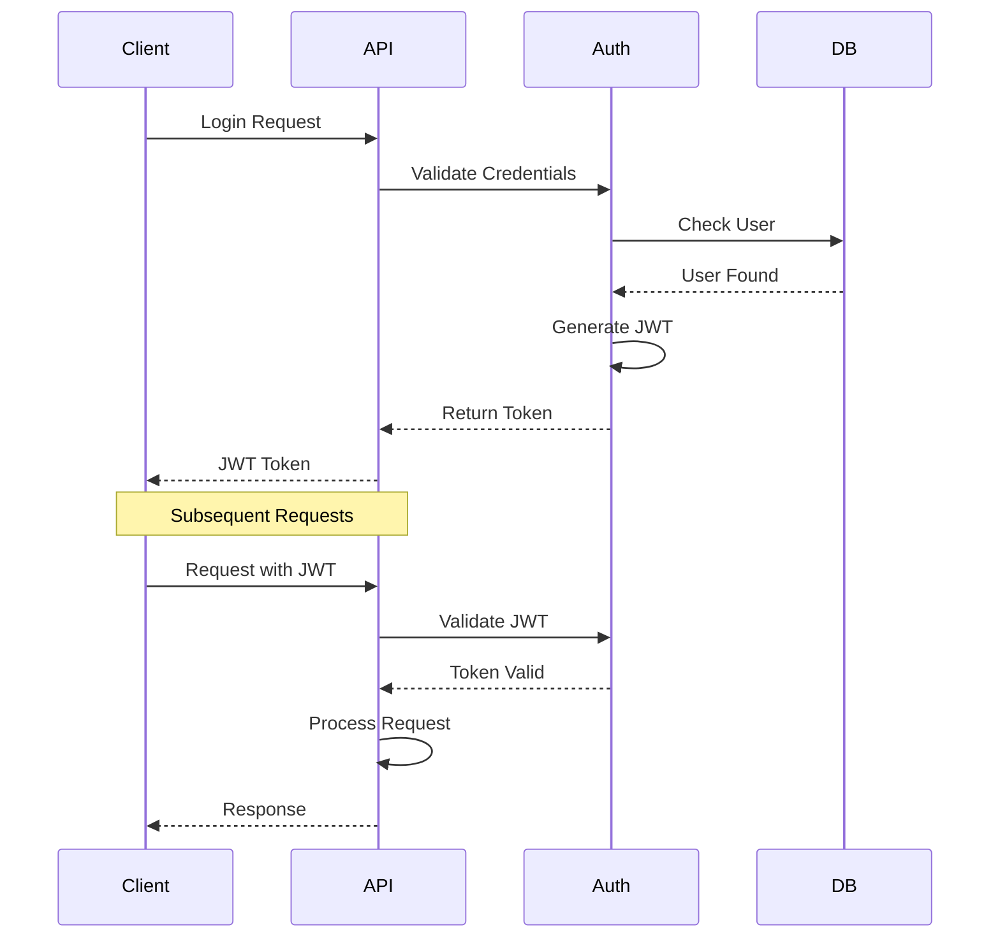
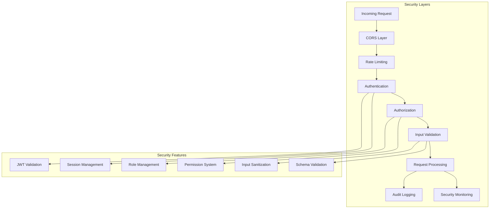
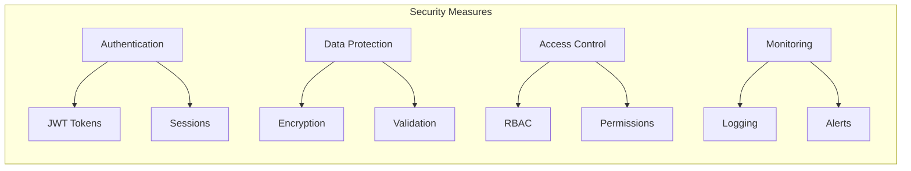
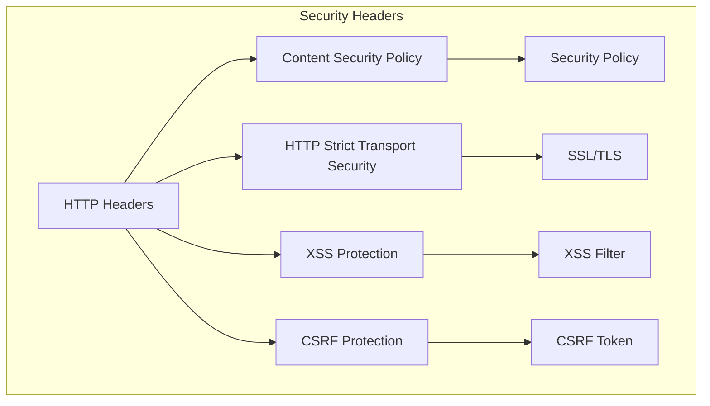
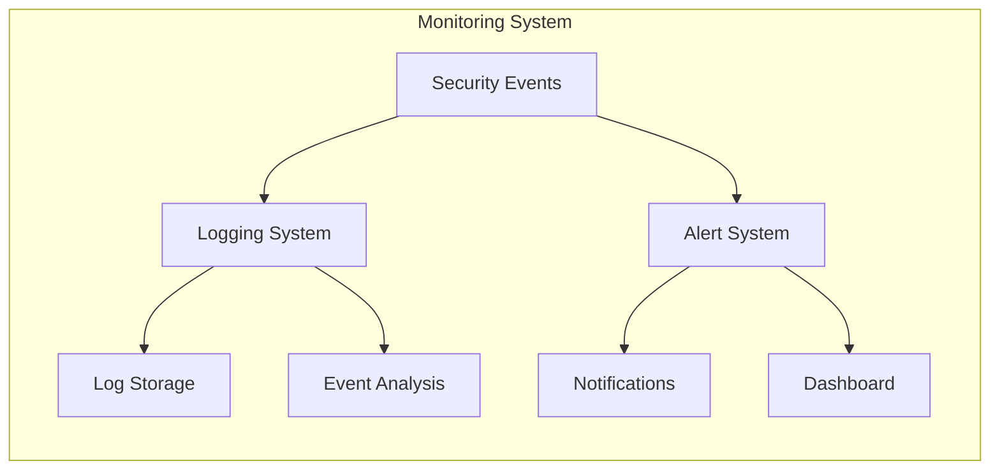

# Authentication & Security

## Authentication Flow



## Security Architecture



## Security Components

### 1. Authentication
- JWT-based authentication
- Token management
- Session handling
- Refresh token mechanism

### 2. Authorization
- Role-based access control (RBAC)
- Permission management
- Resource access control
- API endpoint protection

### 3. Request Security
- Rate limiting
- CORS configuration
- Input validation
- Request sanitization

### 4. Data Security
- Data encryption
- Secure storage
- Data validation
- Schema enforcement

### 5. Monitoring & Logging
- Security event logging
- Audit trails
- Security monitoring
- Alert system

## Security Best Practices



## Security Implementation

### Authentication Implementation
```typescript
// Example JWT Authentication
@Injectable()
export class JwtAuthGuard implements CanActivate {
  constructor(private jwtService: JwtService) {}

  async canActivate(context: ExecutionContext): Promise<boolean> {
    const request = context.switchToHttp().getRequest();
    const token = this.extractTokenFromHeader(request);
    
    if (!token) {
      throw new UnauthorizedException();
    }
    
    try {
      const payload = await this.jwtService.verifyAsync(token);
      request['user'] = payload;
      return true;
    } catch {
      throw new UnauthorizedException();
    }
  }
}
```

### Authorization Implementation
```typescript
// Example RBAC Implementation
@Injectable()
export class RbacGuard implements CanActivate {
  constructor(private reflector: Reflector) {}

  canActivate(context: ExecutionContext): boolean {
    const requiredRoles = this.reflector.get<string[]>('roles', context.getHandler());
    if (!requiredRoles) {
      return true;
    }
    
    const { user } = context.switchToHttp().getRequest();
    return requiredRoles.some((role) => user.roles?.includes(role));
  }
}
```

## Security Headers



## Security Monitoring

